# APM-1 

## Contents

[Sort](#Sort)

[Dynamic Programming](#Dynamic-Programming)

[Greedy](#Greedy)

[Graph](#Graph)

## Sort 

[c++ ](https://github.com/SUNGWOOKYOO/Algorithm/blob/master/src_Cplus/Sort.cpp)  [python](https://github.com/SUNGWOOKYOO/Algorithm/blob/master/src_Python/sw_sort.ipynb)

### Insertion sort

incremental하게 하나씩 원소를 삽입하며 정렬하는 방식

즉, $j$ 번째 이전에 이미 정렬되어있는 상태에서 $A_j$를 삽입한후 제자리를 찾아가는 방식

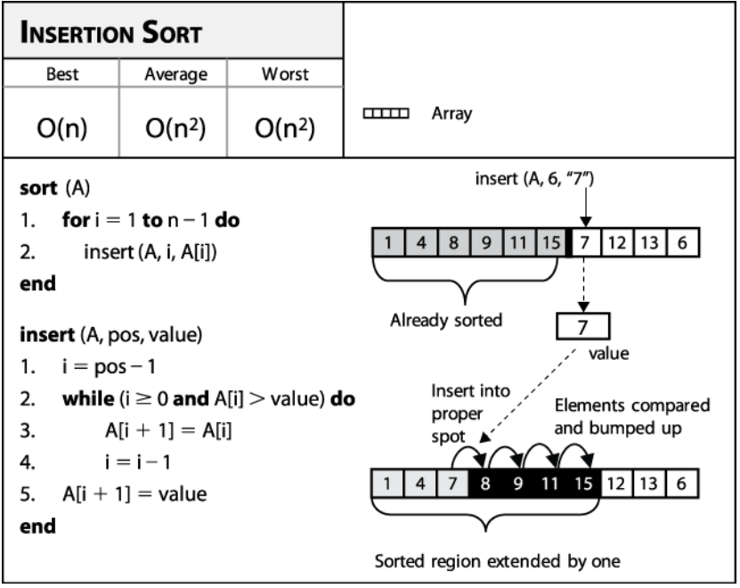

```python
insert(A, j, key)
	i = j - 1
    while i > 0 and A[i] > key
    	A[i+1] = A[i]
        i = i - 1
    A[i+1] = key
    

IS(A)
    for j = 2 to n 
        insert(a, j, a[j])
```


[blog](https://www.oreilly.com/library/view/algorithms-in-a/9780596516246/ch04s02.html)


### Quicksort (increasing order) 

### 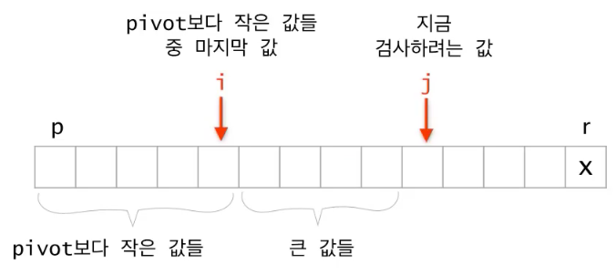

```python
QS(a, p, r)
	if p >= r
		return
	# select random btw p ~ r
	i = random(p,r)
	swap(a[i], a[r]) # 무조껀 뒤로 보냄
	
	# partition
	i = p - 1
	for j = p to r-1
		if a[j] <= a[r]
			i += 1
			swap(a[j], a[i])
    swap(a[i+1], a[r])
    q = i + 1 # a[q] finds a right position
    
    # divide and conquer
    QS(a, p, q-1)
    QS(a, q+1, r)	
```

randomized quick sort가 아닐 경우 **worst case time complexity** 

i 번째 원소에서 분할이 될 때 점화식은 다음과 같다.

$T(n) = T(i-1) + T(n-i) + O(n)$ 

최악의 경우 $i = 1 \,or \,n$ 이고 다음과 같다.

$T(n) = T(n-1) + O(n)$

반복대치를 통해 시간복잡도를 구해보자
$$
\cancel{T(0)} = 0\\
\cancel{T(1)} = \cancel{T(0)} + O(1)\\
\cancel{T(2)} = \cancel{T(1)} + O(2)\\
...\\
T(n) = \cancel{T(n-1)} + O(n)\\
-------------\\
T(n) = O(1)\, + \,...\, + \,O(n) = O(n^2)
$$


proof by mathmatical induction 방법을 통해 randomized quicksort 의 expected time complextiy 증명 
$$
Suppose \;\exist c \;s.t\; T(k) \le ck\log{k} \;\forall \;2\le k <n
$$
$T(n) = T(i-1) + T(n-i) + O(n)$ 에서 i는 1 부터 n 중에서 uniform하게 선택되기 때문에
$$
\begin{matrix}
T(n) &=& \frac{1}{n}\sum_{i=1}^n {T(i-1) + T(n-i)} + O(n)\\
&=& \frac{2}{n}\sum_{k=0}^{n-1}T(k) + O(n)\\
&=& \frac{2}{n}\sum_{k=2}^{n-1}T(k) + \{O(0) + O(1) + O(n)\}\\
&\le& \frac{2}{n}\sum_{k=2}^{n-1}ck\log{k} + O(n)\leftarrow 가정\\ 
&\le& \frac{2}{n}\sum_{k=1}^{n-1}ck\log{k} + O(n)\\
&=& \frac{2c}{n}\{\sum_{k=1}^{[\frac{n}{2}]-1}k\log{k} + \sum_{k=[\frac{n}{2}]}^{n-1}k\log{k}\} + O(n)\\
&\le& \frac{2c}{n}\{\sum_{k=1}^{[\frac{n}{2}]-1}k\log{\frac{n}{2}} + \sum_{k=[\frac{n}{2}]}^{n-1}k\log{n}\} + O(n)\leftarrow \sum_{k=1}^{[\frac{n}{2}]-1}\log{k} \le \log{\frac{n}{2}}이므로\\
&=& \frac{2c}{n}\{\sum_{k=1}^{[\frac{n}{2}]-1}k(\log{n} - 1) + \sum_{k=[\frac{n}{2}]}^{n-1}k\log{n}\} + O(n)\\
&=& \frac{2c}{n}\{\log{n}\sum_{k=1}^{n-1}k - \sum_{k=1}^{[\frac{n}{2}]-1}k\} + O(n)\\
&\le& \frac{2c}{n}\{\log{n}\frac{n(n-1)}{2} - \frac{1}{2}(\frac{n}{2}- 1)(\frac{n}{2})\} + O(n) \leftarrow [\frac{n}{2}] \le \frac{n}{2} 이므로 \\
&=& c(n\log{n} -\log{n} - \frac{n}{8} + \frac{n}{4}) + O(n)\\
&=& O(n\log{n})
\end{matrix}
$$


다른방식으로 **expected running time $O(nlogn)$ 증명**

intuition: quick sort에서 parition 은 $O(n)$ 번 불리게 되어있다. 이때, qicksort의 성능은 pivot이 어디 선택되어 partition 내부 안에서 비교 횟수가  몇번 불리느냐에 달려있다. 모든 $n$ 번의 patition에서 비교 횟수가 불리는 수의 합을 $X$ 라 하면,  time complexity는 $O(n+X)$ 이다.  

그래서 call 되는 patition 함수들 안에서 비교되는 횟수의 합의 평균  $E[X] $가 성능을 좌우한다. 이 값을 구하기위해 그 안에서 정렬된 숫자를 $\{z_i, ...,z_j\}$ 라고 하면, 

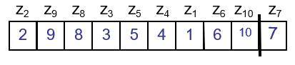

그리고, $E[X]$를 estimate하기위해  i.i.d. $ X_{ij} = 1$ (if $z_i$  is compared to $z_j$, o.w., 0) 를 정의하면 ($P[$ $z_i$  is compared with $z_j] = P_{ij}$ 라 하자, iid 특성은 평균값이 확률값과 같음) 

$E[X] = E[\sum_{i=1}^{n-1}\sum_{j=i+1}^{n}X_{ij}] = \sum_{i=1}^{n-1}\sum_{j=i+1}^{n}E[X_{ij}] = $ $\sum_{i=1}^{n-1}\sum_{j=i+1}^{n}$$P_{ij}$ 이되는데, 

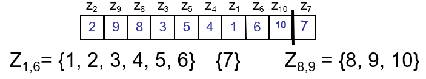

위의 그림으로 부터 알 수 있는 것은, 서로 다른 partition에 있는 $z_i$ 와 $z_j$ 는 절대 비교 안된다는 사실로부터 partition 함수 안에  $z_i$, $z_j$ 가  있어야하며 둘중 하나는 반드시 pivot이 될것 이라는 사실이다. 따라서, $j-i+1$ element 중 $z_i, z_j$가 각각 pivot으로 뽑힐 확률인 $P_{ij} = 2/(j-i+1)$  이다.

다시 되돌아가서, 계산해보면,
$\sum_{i=1}^{n-1}\sum_{j=i+1}^{n}$$2/(j-i+1)$ $\le \sum_{i=1}^{n} \sum_{i \le j}{2/j} = O(nlogn)$

 더 나아가서 ...

r.f. 항상좋은 quick sort 방법은? median of median 이용 [link](http://1ambda.github.io/algorithm/design-and-analysis-part1-2/)

[quickselect c++](https://github.com/SUNGWOOKYOO/Algorithm/blob/master/src_Cplus/QuickSelect.cpp)


### Mergesort

```python
Merge(A, p, q, r)
    n1 = q - p + 1
    n2 = r - q
    let L[1 .. n1 + 1] and R[1 ..n2 + 1] be new arrays
    for i = 1 to n1 
        L[i] = A[p + i - 1]
    for j = 1 to n2 
        R[j] = A[q + j]
    L[n1 + 1] = Inf
    R[n2 + 1] = Inf
    i,j = 1
    for k = p to r
        if L[i] <= R[j]
            A[k] = L[i]
            i += 1
        else
            A[k] = R[j]
            j += 1

MS(A, p, r)
    if p >= r 
        return
    q = (p + r) / 2;
    MS(A, p, q);
    MS(A, q + 1, r);
    Merge(A, p, q, r);
```

**time complexity**

마스터정리를 사용하여 시간복잡도를 구해보자.
$$
T(n) = 2 T(\frac{n}{2}) + O(n)\\
f(n) = O(n)\\
h(n) = n^{\log_{2}{2}} = O(n) = f(n)\\
\therefore T(n) = O(n\log{n})
$$


### Heapsort

```python
# increasing order sort를 위한 max heap 을 기준으로 설명
heapify(A, i) 
    left = 2i
    right = 2i + 1
    
    if right > n 
    	return
    
    # find largest among A[i], A[left], A[right]
    if A[i] < A[left]
    	largest = left
    else 
    	largest = i 
    if A[largest] < A[right]
    	largest = right
    
    swap(A[i], A[largest])
    
    if largest != i
    	heapify(A, largest)

# bottom up 
build_heap(A)	
	A.heapsize = |A|
    for i = A.length / 2 downto 1 
    	heapify(i) 
        
# divide and conquer
make_heap(A, i)
    left = 2i
    right = 2i + 1
    
    if right > n
    	return 
    
    make_heap(left)
    make_heap(right)
    
    if A[i] < A[left]
    	largest = left 
    else largest = i
    if A[largest] < A[right]
    	largest = right
    
    swap(A[i], A[largest])
    
    if largest != i 
    	heapify(A, largest)
        
HS(A)
	build_heap(A)
	for i = |A| downto 2 
    	swap(A[1], A[i])
        A.heapsize -= 1
        heapify(A,1)
```

heapify: $T(n) = T(n/2) + 1 = O(logn)$  

build_heap: $T(n) = 2T(n/2) + O(logn)$
$$
n^{log_2^2} > logn \\ 
\therefore T(n) = O(n)
$$
[divide conquer 를 통한 build heap c++](https://github.com/SUNGWOOKYOO/Algorithm/blob/master/src_Cplus/Heapmain.cpp)


## Dynamic Programming

divide and conquer(recursive call, top down) 에서 memo를 하면 DP 가 된다. 

따라서 크게 top down with memo, bottom up 2가지 접근법

DP를 사용하려면 Optimal substructure, Overlapping subproblem 2가지 성질을 증명해야함

[python](https://github.com/SUNGWOOKYOO/Algorithm/blob/master/src_Python/sw_DPandGreedy.ipynb)

### Rod cutting 

막대 길이에 대한 가격  $p[1..n]$ 이 주어졌을때, 최대한 비싸게 막대를 잘라서 팔아먹는 가격 $r_n$ 

cut을 한 경우과 안할 경우로 나누어 더 좋은것 선택 하면 다음과 같은 식으로 reculsive formula 가능
$r_n = \max(p_n, \underset{1 \le i < n}{\max}{(r_i + r_{n-i})}) \text{, if } n \ge 1$, 

$i=n$을 포함 시키고, $r_i$부분을  $ p_i$로 바꾸고,  $ p_n +r_0 = p_n$으로 하면, 수식 간략화가 가능하다. 
$$
\begin{aligned} 
r_n &= 
\begin{cases}
 \underset{1 \le i \le n}{\max}(p_i + r_{n-i}) & \text{if } n \ge 1 \\
 0 & \text{if } n = 0\\
\end{cases}
\end{aligned}
$$

```python
# topdown with memo
lookup(p, n, r)
	# 저장되어 있다면 저장된 값 return 
	if r[n] >= 0 
    	return r[n]
    # base case 
	if n == 0
    	return 0
    q = -INF
    for i = 1 to n 
    	q = max(q, p[i] + lookup(p, n-i, r))
    # memo
    r[n] = q
    return q 

rodcut(p, n)
	let r[0..n] be a new array 
    # initialization
    for i = 0 to n 
    	r[i] = -INF
    return lookup(p, n, r)

# bottom up 
rodcut(p, n)
	let r[0..n] be a new array 
    r[0] = 0
    for j = 1 to n 
    	q = -INF
        # lookup with memo 
        for i = 1 to j
        	q = max(q, p[i] + r[j-i])
        r[j] = q 
    return r[n]
```

entry 갯수 $n$, 각 entry 계산하는데 $O(n)$ 걸린다. 따라서, $T(n) = O(n^2)$

[c++](https://github.com/SUNGWOOKYOO/Algorithm/blob/master/src_Cplus/Rodcut.cpp)


### Matrix-chain multiplication

matrix multiplication 할때, 계산을 효율적으로 하기위해 parenthesization 을 어떻게 효율적으로 할 것인가?  $m[i, j]$ 는 matrix chain multiplication $A_i A_{i+1} ..A_j $을 계산하는데 필요한 cost

$A_i \in \mathbb{R}^{p_{i-1} \times p_i}$
$$
m[i,j] =
\begin{cases}
0 & \text{if }i=j \\
\underset{i \le k <j}{\min}{(m[i,k] + m[k+1,j] + p_{i-1}p_kp_j)} & \text{if } i<j\\
\end{cases}
$$
$( A_i A_{i+1} ..A_k )$$( A_{k+1} A_{k+2} ..A_j )$ 에 대한 cost  $m[i,k] + m[k+1,j] + p_{i-1}p_kp_j$

```python
# topdown with memo
lookup(p, m, i, j)
	# 저장되어있다면 저장된 값 사용
	if m[i,j] < INF
    	return m[i,j]
    # base case
    if i == j
    	return 0
    
    q = INF
	for k= i to j-1
    	q = min(q, lookup(p, m, i, k) + lookup(p, m, k+1, j) + p[i-1]*p[k]*p[j])
    m[i,j] = q
    return q 

MatrixChain(p, n)
	let m[1..n, 1..n] be a new n × n array 
    all m[:,:] be initialized by INF
    return lookup(p, m, 1, n)

# bottom up 
MatrixChain(p) # p = [p[0], ..., p[n]]
	n = |p|-1
    # base case (chain length l = 1 일때)
    for i = 1 to n 
        m[i,i] = 0
    for l = 2 to n 
    	for i = 1 to n-l+1
        	j = i+l-1
            m[i,j] = INF
            for k = i to j-1
            	q = min(q, m[i, k] + m[k+1, j] + p[i-1]*p[k]*p[j])
            m[i,j] = q
    return m[1,n]
```

bottom up 방식이 좀 어려울수 있다. 

chain length $l = 1, ..., n$ 까지 minimum cost를 업데이트 하면 optimal cost를 찾을 수 있다. 

 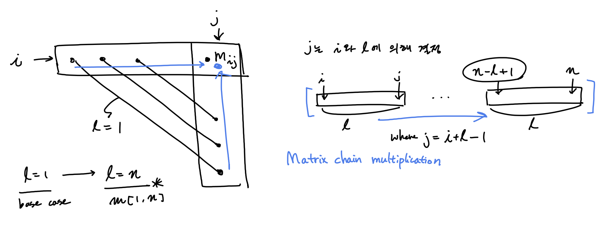

$T(n) = O(n^3)$

[c++](https://github.com/SUNGWOOKYOO/Algorithm/blob/master/src_Cplus/MatrixChain.cpp)


### Longest Common Subsequence

$C_{i,j}$ 는 $X_i$ 와 $Y_j$의 LCS 길이
$X_i = <x_1, ..., x_i>, Y_j = <y_1, ..., y_j>$
$$
C_{i,j} = 
\begin{cases}
0, &\mbox{if } i = 0 \or j = 0 \\
C_{i-1,j-1} + 1 &\mbox{if } i,j > 0 \and x_i = y_j \\
\max\{C_{i-1,j}, C_{i, j-1}\} &\mbox{if } i,j > 0 \and x_i \neq y_j
\end{cases}
$$

```python
# topdown with memo
lookup(X, Y, c, i, j)
	if c[i,j] >= 0
    	return c[i,j]
    # base case
    if i==0 or j==0
    	c[i,j] = 0
    	return c[i,j]
    
    # i > 0 or j > 0
    if X[i] == Y[j]
    	c[i,j] = lookup(X, Y, c, i-1, j-1) + 1
        return c[i,j]
    else
    	c[i,j] = max(lookup(X, Y, c, i-1, j), lookup(X, Y, c, i, j-1))
        return c[i,j]
    
LCS(X, Y)
	m = |X|
	n = |Y|
	let c[0..m, 0..n] be a new array 
    # initialization
    all c[:,:] be initialized by -INF
    return lookup(X, Y, c, m, n)
    
    
    
# bottom up 
LCS(X, Y)
	m = |X|
    n = |Y|
    let c[0..m, 0..n] be a new array 
    all c[:,:] be initialized by -INF
    # base case
    if i == 0 to m
    	c[i,0] = 0
    if j == 0 to m
    	c[0,j] = 0
    for i = 1 to m 
    	for j = 1 to n 
        	if X[i] == Y[j]
            	c[i,j] = c[i-1, j-1] + 1
            else 
            	c[i,j] = max(c[i-1, j], c[i, j-1])
    return c[m,n]
```

$T(n) = O(mn)$

[c++](https://github.com/SUNGWOOKYOO/Algorithm/blob/master/src_Cplus/LCS.cpp)


### Assembly Line 

pdf 참조 

[c++](https://github.com/SUNGWOOKYOO/Algorithm/blob/master/src_Cplus/AssemblyLine.cpp)


###  0 - 1 knapsack

0-1 Knapsack problem is not satisfied with Greedy choice property

$i$ 는 item index, $w$ 는 possible weight, $v_i$는 item $i$ 의 가격 

$c[i,w]$ 는 item $i$개를 주머니에 넣고, 주머니에 담을수 있는 weight가  $w$ 일때의 주머니 안의 물건들 가격   
$$
c[i,w] = 
\begin{cases}
0 &\text{if }i=0 ~ \or w=0  \\
c[i-1,w] &\text{if }  i > 0 ~ \and w < w_i \\
max(v_i + c[i-1,w-w_i], c[i-1,w]) &\text{if } i > 0 ~ \and w \ge w_i
\end{cases}
$$

```python
# topdown with memo
# V[i], W[i]는 item i에 대한 pric와 weight 정보 array
# W(array)와 w(scalar)는 다르다.
lookup(V, W, c, i, w)
	if c[i,w] >= 0
    	return c[i,w]
    # base case
    if i==0 || w==0
    	c[i,w] = 0
        return 0
    if W[i] > w 
    	c[i,w] = lookup(V, W, c, i-1, w)
        return c[i,w]
    else
    	c[i,w] = max(V[i] + c[i-1, w-W[i]], c[i-1, w])
		return c[i,w]

knapsack(V, W, maxW)
	n = |V|
	let c[0..n, 0..maxW] be a new array
    all c[..] initialized by -INF
    return lookup(V, W, c, n, maxW)
        
# bottom up
knapsack(V, W, maxW)
    n = |V|
	let c[0..n, 0..maxW] be a new array
    all c[..] initialized by -INF
    for i = 0 to n
    	for w = 0 to maxW
        	if i==0 || w==0
            	# base case 
            	c[i,w] = 0
            else
				if W[i] > w
                	c[i,w] = c[i-1, w]
                else
                	c[i,w] = max(V[i] + c[i-1, w-W[i]], c[i-1, w])
    return c[n, maxW]
```

$T(n) = O(nW_{max})$

[c++](https://github.com/SUNGWOOKYOO/Algorithm/blob/master/src_Cplus/Knapsack.cpp)


## Greedy

[python](https://github.com/SUNGWOOKYOO/Algorithm/blob/master/src_Python/sw_DPandGreedy.ipynb)

### Activity Selection Problem 

여러 starting time, finish time 을가진 activity $a = [s,f]$들이 있을 때 주어진 시간내에 compatible 한 activity들을 가장 많이 포함시킬 수 있도록 scheduling 하는 문제

naive 하게 생각 해보면 $n$개의 activity들 이 있을때 $2^n$ 가지의 모든 subset 에서 각 subset 마다 가지고있는 activity들이 서로 compatible한지 검사하고, 모든 activity들이 compatible하다면 그 갯수를 저장하고, 그 중 최대를 갖는 subset를 찾는다. 

$S_k|_{k=[1,2^n]} = \{ \text{최대 n 개의 activity} \}$ 

이때, $\{ .. \}$안의 각 activity들이 서로 compatible 한가 test (All pair로 검사한다면, $O(n^2)$걸림 )

따라서, $O(2^n n^2)$ 이므로 너무 비싸다. 

조금 나아가 생각해보면, activity 들이 만약 finishing time에 의해 sorting 되어 있다고 가정해보자. 

그러면 compatible test 에서 linear하게 scan하면 된다. ($i$번째에서 starting time이 $i-1$번째의 finishing  time보다 앞선 다면 compatible하지 않은 것이므로 즉, $a_i.s < a_{i-1}.f$ 이면 non compatible 함) 

따라서, $O(2^n n)$ 으로 약간 개선된다. (activity 들이 만약 finishing time에 의해 sorting 되어 있다고 가정한 상황이므로 sorting 시간 무시)

**DP** 이용 

여기서 더 개선 하기 위해선, 모든 subset을 보지 않고, overlapping되는 subproblem들을 이용한다. 

(새롭게 notation을 정의함)

가정 상황: activity 들이 finishing time에 의해 sorting 되어 있다.

여기선 어떻게 문제를 정의 하느냐에따라 time complexity가 달라질 수 있다.

**approach1 **교재의 방식은 

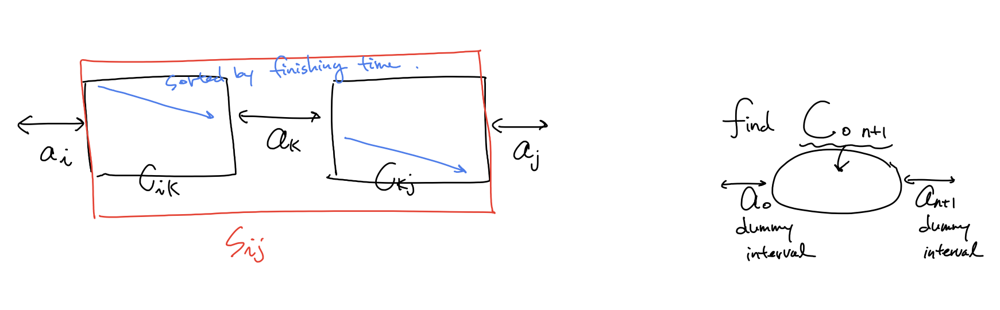

$S_{0,n+1}$ 의 원소 갯수가 최대가 되도록 선택을 하고 싶다! (dummy 원소 $a_0, a_{n+1}$ 두고)

$c[i,j]$를 $S_{ij}$ 안에서 <u>compatible한</u> activity들의 최대수로 정의
$$
c[i,j] = 
\begin{cases}
0 & \text{if}~ S_{ij} = \empty \\
\underset{i < k < j ~ s.t. ~ a_k ∈ S_{ij}}{\max}(c[i,k] + c[k,j] + 1) & \text{if}~ S_{ij} \neq \empty 
\end{cases}
$$
$T(n) = O(n^3) $


**approach2** 또 다른 방식으로 entry수를 $n$으로 줄여 보았다. 

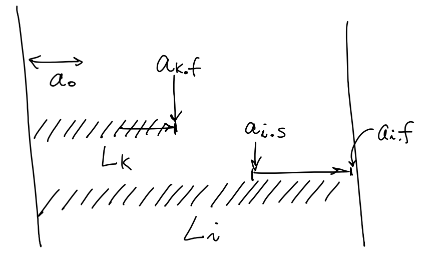

$L_i$ 는 <u>$a_i$를 포함</u> 하는 $0,..., i $에 대해 compatible 한 activity 갯수

따라서,  $L[0..n]$까지 업데이트 후에 가장 max인 값을 택해야한다. 
$$
\begin{aligned}
L_i &=
\begin{cases}
\underset{0 \le k<i ~ s.t ~ a_k.f \le a_i.s}{\max}{(L_k + 1)} & \text{if } a_0.f \le a_i.s &\text{#하나라도 compatible 한 activity존재}\\
1 & \text{o.w} 
\end{cases} \\
result &= \underset{1 \le i \le n}{\max}{L_i}

\end{aligned}
$$
$T(n) = O(n^2) $

[c++](https://github.com/SUNGWOOKYOO/Algorithm/blob/master/src_Cplus/1370_Congress.cpp)


**greedy choice이용**

greedy choice는 compatible한 activity중  finishing time이 가장 빠른것을 선택.

redefine for greedy algorithm 

$S_{ij} -> S_k $ = {$a_i ∈ S: s_i \ge f_k $} 

If we use greedy algorithm, DP formula can be transformed. 

$$
\begin{aligned}
c[0,n+1] &= c[0,m_1] + c[m_1, n+1] + 1 &m_1\text{ is greedy choice} \\ 
&= c[m_2, n+1] + 1 + 1 &m_2\text{ is greedy choice}\\
&= c[m_3, n+1] + 1 + 1 + 1 &m_3\text{ is greedy choice}\\
&= ~ ... \\
&= c[m_m, n+1] + m
\end{aligned}
$$

note that  $c[0,m] = 0, c[m_1,m_2] = 0, ... ,c[m_{m-1},c_m] = 0$ , where $m \le n $

따라서, entry를 줄일 수 있다(entries are decreased by O(n), each entry takes O(1)).

greedy algorithm에 대한 recursive formula 를 적어보았다.
$$
\begin{aligned}
m_k &= 
\begin{cases}
0 & \text{if } k=0 &\text{ base case}\\
k & \text{if } a_{m_{k-1}.f} \le a_k.s &\text{find a first compatible activitiy} \\
m_{k-1} & \text{o.w }
\end{cases} \\

A_k &=
\begin{cases}
A_{k-1} + 1 & \text{if } a_{m_{k-1}}.f \le a_k.s &\# k\text{ is greedy choice}\\
A_{k-1} 
\end{cases} 
\end{aligned} \\
$$
$A_n$ 값을 찾으면 된다. 

```python
# recursive version 
def Recursive_Greedy(s,f,k,n)
    m = k+1
    # Find appropriate m for using optimal sol
    # m은 compatible한 activity중  finishing time이 가장 빠른 activity index 
    while m <= n and s[m] < f[k]
        m = m + 1 
    
    if m <= n 
        return 'a_m' union Recursive_Greedy(s,f,m,n)
    else:
        return None
        
# iterative version 
def Iterative_Greedy(s,f)
    n = |s|
    A = 'a_1' # A always has a1 
    k = 1 
    for m = 2 to n:
        if s[m] >= f[k]:
            A = A union 'a_{}'.format(m)
            k = m 
    return A 
```

Therefore, 
$$
T(n) = O(n), \text{ suppose that prepressing sortng }~ a_k \text{ with finishing time }
$$
[c++](https://github.com/SUNGWOOKYOO/Algorithm/blob/master/src_Cplus/ActivitySelection.cpp)


### Fractional Knapsack

Fractional Knapsack Problem through Greedy algorithm

Greedy choice : first of all, an item with higher Unit price per weight must be selected

preprocessing으로 quick sort를 이용하여 무게당 가격이 높은 순으로 $O(nlogn)$시간에 sorting하고,  

그 순서대로 아이템을 $O(n) $시간에 linear scan하며 물건을 담을 수있다면 물건을 담고, 아니면 일부만 담는다. 

notation은 [0-1 knapsack problem](#0 - 1-knapsack) 과 동일 

```python
# assume that V[i], W[i] sort by decreasing order with (V[i]/W[i])
knapsack(V, W, maxW) {
    n = |V|
	residualw = maxW;
    profit = 0
	for i = 1 to n
    	# 담을 수 있다면, 담는다.
		if W[i] <= residualw
			profit = profit + V[i]
			residualw = residualw - W[i]
		# 담을 수 없다면, 일부만 담고 종료
    	else {
			# w[i] > residualw
			profit += V[i]*(residualw/w[i]);
			break;
		}
	}
	return result;
```

[c++](https://github.com/SUNGWOOKYOO/Algorithm/blob/master/src_Cplus/Knapsack2.cpp)


## Graph 

### Implementation Pros and Cons

*Describe the linked list representation of a graph*

각 정점에 인접한 정점들을 2차원 배열의 자료구조로 표현하는 방법이다.

정점의 개수가 n개인 그래프가 주어졌을 때 n$\times$ n matrix를 준비한다.

가중치가 없는 그래프라면 가중치의 값을 항상 1로 할당한다.

정점 i에서 정점 j로 가는 간선이 존재하면 그 가중치의 값을 원소의 값으로 할당한다.

간선이 존재하지 않으면 값을 0으로 할당한다.

- Advantage
  - 간선의 존재여부를 확인하는데 상수 시간 (O(1))이 소요된다. 
- Disadvantage
  - 그래프를 생성하는데 $n^2$ 의 메모리와 O($n^2$) 의 시간이 소요된다.

*Describe the adjacency matrix representation of a graph*

각 정점에 인접한 정점들을 리스트로 표현하는 방법이다.

정점의 개수가 n개인 그래프에서 n 길이의 list를 준비한다.

각 정점에 인접한 정점들을 연결리스트로 매단다.

각 노드는 정점번호, 가중치, 다음 정점의 포인터 로 구성된다.

필요한 총 노드 수는 총 간선수의 두배이다.

- Advantage
  - 그래프를 생성하는데 2|E|만큼의 메모리가 소요되므로 간선 수가 적은 경우 유용하다.
- Disadvantage
  - 간선 수가 많은 경우 (|E| > |V|) 오히려 필요한 오버헤드가 크다.
  - 간선의 존재여부를 확인 하는데 O(n) 시간이 소요된다. 


### BFS

Queue를 이용하여 search 혹은 shortest path 찾음 

가장 쉬운 알고리즘으로는 모든 edge weight(distance)를 1로 둔 방식

```python
BFS(G, s)
	let visited[1 ..|G.V|] be a boolean array and all initialized by False
	create queue Q
	Q.push(s)
	visited[s] = True

	while !Q.empty()
		u ← Q.pop()
        
		# update u.d timing
        # print u
        
		for v in G.adj[u]
        	# 이전에 방문한적이 없다면 방문
			if visited[v] == False
				Q.push(v)
				visited[v] = True

# for forest G 
BFSAll(G)
	let visited[1 ..|G.V|] be a boolean array and all initialized by False
    for s in G.V
    	if visited[s] == False
            # 기존 BFS에 visited를 argument로 import하여 사용
        	BFS(G, s, visited)
```

adjacent list 자료구조를 사용한 graph라면 모두 한번씩 보게 되므로 $T(n) = O(|V|+|E|)$  

[blog 설명](https://gmlwjd9405.github.io/2018/08/15/algorithm-bfs.html) [python](https://github.com/SUNGWOOKYOO/Algorithm/blob/master/src_Python/sw_graph/BFS.ipynb) [c++](https://github.com/SUNGWOOKYOO/Algorithm/blob/master/src_Cplus/graphAlgo/DFS_BFS.cpp)


### DFS

stack을 이용하여 search 혹은 shortest path 찾음

DFS can be implemented by recursive call without stack 

because recursive call means using a stack in our main memory(stack field)

```python
# iterative version
DFS(G, s)
	let visited[1 ..|G.V|] be a boolean array and all initialized by False
	create stack S
	S.push(s)
	visited[s] = True

	while !S.empty()
		u ← S.pop()
        
		# update u.d timing
        # print u
        visited[u] = True
        
		for v in G.adj[u]
        	# 이전에 방문한적이 없다면 방문
			if visited[v] == False
				S.push(v)
                
# recursive version
# function call시 내재된 stack이용 
Util(G, u, visited)
	# similar with u ← S.pop() 
    
	# update u.d timing
    # print u
	visited[u] = True;
    
    for v in G.adj[u]
    	if visited[v] == False
        	Util(G, v, visited)
    
    # update v.f set timing
    # ..
    return 

DFS(G, s)
	let visited[1 ..|G.V|] be a boolean array and all initialized by False
    # similar with S.push(s)
    Util(G, s, visited)

# for forest G 
DFSAll(G)
	let visited[1 ..|G.V|] be a boolean array and all initialized by False
    for s in G.V
        if visited[s] == False
        	# same with Until(G, s, visited)
        	DFS(G, s, visited)
```

adjacent list 자료구조를 사용한 graph라면 모두 한번씩 보게 되므로 $T(n) = O(|V|+|E|)$  

[blog 설명](https://gmlwjd9405.github.io/2018/08/15/algorithm-bfs.html) [python](https://github.com/SUNGWOOKYOO/Algorithm/blob/master/src_Python/sw_graph/DFS.ipynb) [c++](https://github.com/SUNGWOOKYOO/Algorithm/blob/master/src_Cplus/graphAlgo/DFS_BFS.cpp)


### Topological Sort 

DFS 를 쓰는 application 중 한가지인 Topological sort 방법

**기본 가정: DAG(Directed Acyclic graph)에서만** 쓸수 있다.

DAG에서 즉, 방향 그래프에 존재하는 각 정점들의 선행 순서를 위배하지 않으면서 모든 정점을 나열하는 것

```python
topoDFS(G, u, visited, S)
	visited[u] = True
    for v in G.adj[u]
    	if visited[v] == False
        	topoDFS(G, S, visited, v)
            
	# update v.f set timing
    S.push(v)
    
TopoSort(G)
    create stack S
    create list L
    let visited[1 ..|G.V|] be a boolean array and all initialized by False;

    # DFS를 하면서 finishing time의 increasing order로 Stack S 에 넣는다.
    # adjacent list 에서의 순서에 따라 search 순서가 다를 수 있으므로 생각할때는 다음과 같이 가정
    # Let assume that the node with small number has a higher priority when DFS search  
    for u in G.V
        if (visited[u] == false)
            # DFS search starts at 'u' ...
            topoDFS(G, u, visited, S)
    
    # Stack S를 뒤집은 결과를 L이라하면, 이 결과가 곧 topolgical sort 
    while !S.empty()
        L ← S.pop()

    return L
```

adjacent list 자료구조를 사용한 DFS 를 이용했으므로  $T(n) = O(|V|+|E|)$  

[c++](https://github.com/SUNGWOOKYOO/Algorithm/blob/master/src_Cplus/graphAlgo/DirectedWeightGraph.h) [python](https://github.com/SUNGWOOKYOO/Algorithm/blob/master/src_Python/sw_graph/TopologicalSort.ipynb) [greeksforgeeks 설명](https://www.geeksforgeeks.org/topological-sorting/) [한국어 블로그](https://gmlwjd9405.github.io/2018/08/27/algorithm-topological-sort.html)


### Single Shortest Path

source vertex 로부터의 shortest path 와 distance를 찾아 내는 알고리즘

#### Bellman Ford

**기본가정:  no negative weight cycle(있다면 False return)**

> Dijkstra’s algorithm과 달리 Bellman Ford 알고리즘은 가중치가 음수인 경우에도 적용 가능. 음수 가중치가 사이클(cycle)을 이루고 있는 경우에는 작동하지 않는다.

naive 하게 그래프 정점 수만큼 그래프 내 모든 엣지에 대해 *edge relaxation*을 수행한다.  그러면 (negative weight cycle 이 없다는 가정하에) 모든 정점수 만큼의 *relaxation*을 돌았을때, shortest path를 찾을 수 있다. 

```python
Bellman(G, s)
	# shortest distance 값을 저장할 array
	let d[1 ..|G.V|] be a new array
    
    # initialization
    d[k] = INF for all k in G.V except for k == s 
    d[s] = 0
    
    # edge relaxations for all cases O(VE)
    for i = 1 to |G.V|
    	for (u,v) in G.E
        	if d[v] > d[u] + w(u,v)
            	d[v] = d[u] + w(u,v)
    
    # check whether eixist negative weight cycle
    # negative edge 가 있다면 edge relaxation을 했을때
    # shortest path distance보다 작은 distance 가 존재 할 것이다.
    for (u,v) in G.E
    	if d[v] > d[u] + w(u,v)
        	return False
        
    return d
```

모든 cases 에 대해 edge relaxation을 수행해야하므로 $T(n) =O(VE)$

[c++](https://github.com/SUNGWOOKYOO/Algorithm/blob/master/src_Cplus/graphAlgo/BellmanFord.cpp)  [python](https://github.com/SUNGWOOKYOO/Algorithm/blob/master/src_Python/sw_graph/SsSP_BellmanFord.ipynb) [한국어 블로그]([https://ratsgo.github.io/data%20structure&algorithm/2017/11/27/bellmanford/](https://ratsgo.github.io/data structure&algorithm/2017/11/27/bellmanford/))


####  DAG 

Topological sort를 사용하여 Bellman Ford 를 좀더 개선한 방식 

기본가정: Topological sort를 사용해야하므로 **DAG에 대해서만** 사용가능 

Bellman ford 알고리즘은 naive하게 모든 가능한 경우의 수에 대해서 *edge relaxation* 을 수행하였다. 

DAG algorithm은 좀더 효율적이게 topolgical sort를 한 순서의 정점 리스트를 바탕으로 *edge relaxation*을 수행

```python
Bellman(g, s)
	let d[1 ..|G.V|] be a new array
	# initialization
    d[k] = INF for all k in G.V except for k == s 
    d[s] = 0
    
    # edge relaxations for a efficient way 
    L = TopoSort(G);
    for u in L
    	for (u,v) in G.E
        	if d[v] > d[u] + w(u,v)
            	d[v] = d[u] + w(u,v)
                
    return d 
```

Topological sort를 한 List 순으로 진행되므로  $T(n) =O(V + E)$

[c++](https://github.com/SUNGWOOKYOO/Algorithm/blob/master/src_Cplus/graphAlgo/DAG.cpp) [python](https://github.com/SUNGWOOKYOO/Algorithm/blob/master/src_Python/sw_graph/SsSP_DAG.ipynb)


#### Dijkstra

**기본가정: 모든 edge가 non negative 이어야함** (가중치가 음수인 경우 작동하지 않는다)

priority queue 를 이용한 알고리즘 

```python
# version 1 
Dijkstra(G, s)
	# initialization
    k.d = INF for all k in G.V except for k == s 
    s.d = 0
     
    # vertices in set S have already shortest path distance
    create set S 
    # priority queue Q(min heap)의 {key=vertex, value=vertex.d]}
    # value가 낮을 수록 priority is higher 
    create priority queue Q
    Q ← all G.V 
    
    while !Q.empty()
    	u = Q.pop()
        S ← u
       	for v in G.adj[u]
        	if v not in S and v.d > u.d + w(u,v)
            	v.d = u.d + w(u,v)
                # update distance of v in O(log|V|)
                Q.update_value(v, v.d) 

# version 2 (priority queue에 update_value 함수가 없는 경우)
# 대신, 느림
Dijkstra(G, s)
    let d[1 ..|G.V|] be a new array
    # initialization
    d[k] = INF for all k in G.V except for k == s 
    d[s] = 0

    # vertices in set S have already shortest path distance
    create set S 
    # priority queue Q(min heap)의 {key=vertex, value=d[vertex]}
    create priority queue Q
    Q ← {s, d[s]}

    while !Q.empty()
        u = Q.pop()
        S ← u
        for v in G.adj[u]
            if v not in S and d[v] > d[u] + w(u,v)
                d[v] = d[u] + w(u,v)
                # push updated {v, v.d} in Q
                Q.push(v, v.d) 
```

version 1 의 time complexity 로 설명하면, $O((|V|+|E|)log|V|)$

[geeksforfeeks](https://www.geeksforgeeks.org/dijkstras-shortest-path-algorithm-using-priority_queue-stl/) [c++](https://github.com/SUNGWOOKYOO/Algorithm/blob/master/src_Cplus/graphAlgo/Dijkstra.cpp) [python](https://github.com/SUNGWOOKYOO/Algorithm/blob/master/src_Python/sw_graph/SsSP_Dijkstra.ipynb) [python hw](https://github.com/SUNGWOOKYOO/APMtask/tree/master/HW2_solution)


**Dijkstra algorithm correctness 증명**

proof by Induction 을 통해 증명하겠다. 

loop invariant 는 매 iteration의 시작점에서 $u.d = \delta(s,u)$ 즉, shortest path distance 

shortest path 가 결정된 vertex 집합을 $S$라 하고, 매 iteration 마다 정점 하나씩 추가된다.

**base case:** 시작점 source vertex의 shortest distance 는 0이므로 $s.d = \delta(s,s) = 0$ correct 

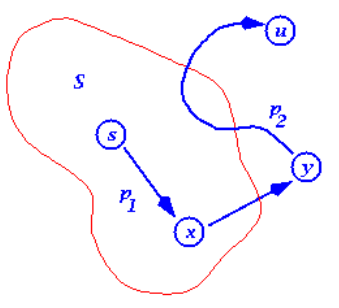

**Induction step:** 임의의 iteration 이전까지는 S안에 shortest path distance들이 결정된 vertex들만 들어가다가 <u>dijkstra 알고리즘에의해 처음으로 $\color{red}u.d \neq  \delta(s.u)$ 인 $\color{red}u$가 queue에서 뽑혔다고 하자.(모순을 이끌어내겠다.)</u>

 이때, $s$부터 $u$ 까지의 shortest path에서 $S$의 경계점 바로 직전과 직후의 정점 $x$와 $y$ 를 생각해 보자. 

일단. $x.d = \delta(s,x)$ 가 자명하다($S$가 shortest path distance가 결정된 정점 집합이라고 했으므로)

그래서, $y.d = \delta(s,x) + w(x,y) = \delta(s,y)$ 는 shortest distance 인 상황이며, 

이 사실과 negative edge가 없다는 사실로부터 ($\delta(y,u) \ge 0$)
$$
\begin{aligned}
u.d &> \delta(s,u) = y.d + \delta(y,u)\ge y.d \\
\therefore u.d &> y.d
\end{aligned}
$$
임을 주목해보자.

이 상황에서, 우리의 처음 가정이 맞다면, $u.d \le y.d $이어야한다. ( dijkstra 알고리즘에의해 처음으로  $u.d  \neq  \delta(s.u)$ 인 u가 queue에서 뽑혔다고 했으므로 $u.d$가 같거나 더 작아야한다.)

하지만, 그렇지 않기 때문에  모순이 된다. 

따라서, $\color{red}u.d = \delta(s,u)$ 인 $\color{red}u$가 뽑혀야만 한다.


[web 영문 설명](http://www.mathcs.emory.edu/~cheung/Courses/323/Syllabus/Graph/dijkstra3.html)


### All pair shortest path

#### Naive DP

$ l_{ij}^{(m)}$ node $i$ 부터 node $j$ 까지 가는데 최대  $m$ 개의 edge를 거쳐서 가는 path의 minimum weight 

> [intution]
>
> 이때, 총 노드의수 를 $n$ 이라하면, 거쳐가는 edge의 수 $m$이 $n-1$보다 많으면 반복되는 node가 존재한다는 뜻이므로 cycle이 있다는 뜻인데, negative edge가 없다고 가정했으므로 당연히 cycle을 돌면 shortest path의 wieght sum 보다 높은 path sum이 된다.  즉, $m = n - 1$ 까지 update하면 optimal solution이 됨

$ {min}{(l_{ij}^{(m-1)},  \underset{1 \le k \le n}{min}{(l_{ik}^{(m-1)} + w_{kj} )} )}  = \underset{1 \le k \le n}{min}{(l_{ik}^{(m-1)} + w_{kj} )} ~~~~ \text{if } m \ge 1$ 

$\because k = j $ 이면 $w_{jj}=0$ 이 되므로 case가 합쳐질수 있다. 

따라서, recursive formula 는 다음과 같다.  
$$
l_{ij}^{(m)} =
\begin{cases}
\underset{1 \le k \le n}{min}{(l_{ik}^{(m-1)} + w_{kj})} & \text{if } m \ge 1  \\
l_{ij}^{(0) } = 
	\begin{cases} 
		0 & \text{if } i = j\\ 
		\infty & \text{if } i \neq j
    \end{cases} & \text{if } m = 0  \\
\end{cases}
$$

여기서 또 주목할 만한점은 $m=1 $ 일때는 $l_{ij}^{(1)} = w_{ij}$ 이므로 $l_{ij}^{(0)}$을 굳이 계산할 필요는 없다.

$O(n^4)$ 이 걸리는 아주 비싼 알고리즘이다.  $ \because n^3$ entries, each entry takes $O(n)$

```python
# update next step for m 
update(L,W)
	n = len(L)
	let L`[1..n, 1..n] be a new array
	for i = 1 to n 
		for j = 1 to n 
			L`[i,j] = INF
			# each entry can be calculated in O(n)
            for k = 1 to n 
            	L`[i,j] = min(L`[i.j], L[i.j] + W[k,j])
    return L`

# given a graph's weight matrix W[1..n, 1..n]
APSP(W)
	n = len(W)
	let L[1..n, 1..n] be a  new array
	
	# initialization
	L = W
	
	# update L for m 
	for m = 2 to n-1
		L =  update(L, W)
    
    retrun L
```

[python](https://github.com/SUNGWOOKYOO/Algorithm/blob/master/src_Python/sw_graph/ApSP_FindingSP.ipynb)


$m$ 에 대해 linear 하게 update 하는 위의 방식을 조금 더 개선해보자. 

L 의 계산이 *associative*한 성질을 가지며, $m \ge n - 1$이면 shortest path weight는 고정되어 L 은 바뀌지 않는다.

따라서, associative 하게 $k$번 계산하여 $2^k \ge n-1$ 일 경우 optimal sol으로 고정된다.

따라서, optimal sol에 도달하기 까지$k = O(logn)$ 번 연산하게 됨.  
$$
\begin{aligned}
L^{(1)} &= W \\
L^{(2)} &= W^2 = WW \\
L^{(4)} &= W^4 = W^2W^2\\
... \\
L^{(2^k)} &= W^{2^k} = W^kW^k\\
L^{(2^k \ge~ n-1)} &= W^{2^k \ge ~ n-1} (fixed)\\
\end{aligned}
$$

```python
# given a graph's weight matrix W[1..n, 1..n]
faster_APSP(W)
	n = len(W)
	let L[1..n, 1..n] be a  new array
	
	# initialization
	L = W
	
	# update L for m 
	for m = 2 < n-1
		L =  update(L, L)
		m = m*2
    
    retrun L
```

$O(n^3logn)$ 으로 계선되었지만 여전히 비싼 알고리즘이다. 


#### Floyd Warshall Algorithm

All pair shortest path with DP 를 조금더 효율적으로 해보자는 접근

**기본 가정: no negative cycle** 

 먼저 주어진 그래프에 대한 edge정보로 부터 matrix $C$ 정의 
$$
C_{ij} = \left \{ 
\begin{matrix}
0 & \text{if } i=j \\
c(i,j) \ge 0 & \text{if } i \ne j, (i,j) \in E  \\
\infty & \text{if } i \ne j, (i,j) \notin E \\
\end{matrix}\right.
$$
$d_{ij}^{(k)}$: $v_i  \text{~} v_j$ 까지 가는데 $v_1, .., v_k$를 거쳐가는지에 대한 유무가 update된 shortest path distance ($k$ 가 증가함에따라 점점 더 많은 노드정보를 거쳐가는것에 대한 정보를 업데이트 된다).

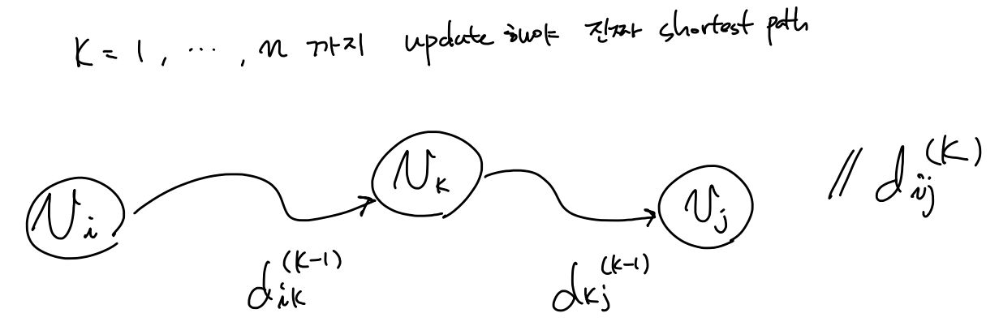
$$
d_{ij}^{(k)} = \left \{ 
\begin{matrix}
c(i,j) \ge 0 & \text{if } k=0 \\
min \{ d_{ij}^{(k-1)}, d_{ik}^{(k-1)} + d_{kj}^{(k-1)}   \} & \text{if } k \ge 1  \\
\end{matrix} \right.
$$
Time complexity: $O(n^3)$ because all entry $(1\le i,j,k\le n)$ ,  is $n^3$, each entry takes $O(n)$ time

back propagation: $P^{(k)}$의 각 entry $P_{ij}^{(k)}$가 의미하는것은 현재까지 업데이트된 $v_k$ 를 지나는 $v_i \rightsquigarrow v_k \rightsquigarrow  v_j$ 의 shortest path 정보를 의미한다. ($k = 1,..,n$ 까지 모두 update되어야 진짜 shortest path가 됨)

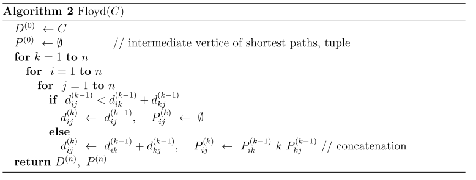

[python](https://github.com/SUNGWOOKYOO/Algorithm/blob/master/src_Python/sw_graph/ApSP_FloydWarshall.ipynb)  [c++](https://github.com/SUNGWOOKYOO/Algorithm/blob/master/src_Cplus/graphAlgo/FloydWarshall.cpp) 


#### Johnson

Dijkstra 와 BallmanFord를 이용한 알고리즘

[c++ ](https://github.com/SUNGWOOKYOO/Algorithm/blob/master/src_Cplus/graphAlgo/Johnson.cpp) [python](https://github.com/SUNGWOOKYOO/Algorithm/blob/master/src_Python/sw_graph/ApSP_Johnson.ipynb)


### MST

MST(Minimum Spanning Tree) 를 구하는 것

기본 용어 설명
> *light edge*: 어떤 정점 집합을 둘로 나누는 *cut*을 했을때, *crossing edge* 중에 weight가 가장 작은 edge 
>
> *safe* 하다: weight의 sum 이 minimum을 갖는 spanning tree에 대해서 어떤 edge $(u,v)$ 를 더해도 그 특성이 유지 된다면 *safe* 하다고 한다.

일반적인 MST 알고리즘은 다음과 같다

```python
MST(G)
	create set A 
	while A does not form a spanning tree
		find an edge (u,v) that is safe for A 
		A = A union {(u,v)}
    return A
```


#### Kruskal 

greedy method 을 이용하여 네트워크(가중치를 간선에 할당한 undirected 그래프)의 모든 정점을 최소 비용(최소 경로)으로 연결하는 최적 해답을 구하는 것

disjoint set 자료구조를 활용하며, greedy 하게 *light edge* 를 추가하면 *safe*함을 이용함

방법: <u>disjoint set 자료구조를 활용하여</u> independent 한 tree들을 만들고, <u>작은 weight를 가진 edge 순서대로</u> crossing하는 edge에 대해서 tree들을 merge해 나간다. 즉, safe 할때, merge한다.

> disjoint set에 2 가지 heuritic 이 사용된다. 
>
> 1. path compression 
> 2. union by rank
>
> 이 2가지의 heuristic을 사용하면, n 개의 disjoint set이 있을때(n 번의 makeset operation 이 수행된 상태),
>
> makeset, findset,union operation이 모두 m 번 call 된다고하면,  
>
> 전체 operation을 수행하는데 $O(m\alpha(n))$만큼의 시간이 걸린다. 
>
> 여기서, $\alpha(n)$ 은 $logn$ 에 upper bounded 되어있어서 효율적인 operation 수행이 된다. 

```python
DisjointSet
	__init__(n)
    	let parent[1..n] be a new array
        let rank[1..n] be a new array
        # DisjointSet을 만드는 순간 n 번의 makeset operation 
    	for i=1 to n 
        	rank[i] = 0
            parent[i] = i 
    
    findset(u)
    	# path compression(한번 representative를 찾을때 이어놓는다)
    	if u != parent[u]
        	parent[u] = findset(parent[u])
        retun parent[u]
	
    union(x, y)
    	# find each representative for the set that includes x and y
    	x = findset(x)
        y = findset(y)
        
        # union by rank(rank가 작은 disjoint set을 큰쪽에 연결)
        # y 의 rank 가 x 보다 같거나 크면, y를 x.p 로 한다. 
        # (rank가 같을때는 y에 연결후, y rank만 1증가) 
        if rank[x] > rank[y]
        	parent[y] = x 
        else 
        	parent[x] = y
        if rank[x] == rank[y]
        	rank[y] = rank[y] + 1

kruskal(G)
	# weight sum 
    sum = 0;
    
    # initialization
    create DisjointSet Ds;
    # makeset for all v in G.V : O(V)
    Ds ← all v in G.V 
    create a empty MST set A 
    
    # preprocessing
    # sort G.E by (weight)increasing order : O(ElogE) 
    sort(G.E);  
    
    # 서로 다른 distinct component를 crossing하는 edge 중에서 
    # weight가 가장 작은 light edge를 greedy 하게 찾는과정(DisjointSet 이용)
    # O((V+E)α(V)) 여기서 α(V) upper bounded by O(logV)
    for (u,v) in G.E
        if Ds.findset(u) != Ds.findset(v) 
            # (u,v) edge is a greedy choice 
            # update the sum of MST weight 
            sum = sum + w(u,v);
            Ds.union(u, v);
            A = A union {(u,v)}

    return sum;
```

 kruskcal 알고리즘이 전체과정에서 makeset $O(|V|)$, findset $O(|E|)$, union $O(|V|)$ 번 call 되므로 

kruskcal 알고리즘에서 for문에서 쓰인 disjoint set의 operation 수는 $|V|+|E|$  번이므로 

time complexity는 $O((|V|+|E|)\alpha(|V|)$ 인데, 

$\alpha(n)$ 은 $logn$ 에 upper bounded 되어 있고, 

graph G가 connected 되어있다면,  $|E| \ge |V|-1 $ 이고, 

graph G가 sparse 하다면 $|E| > |V|^2$ 이므로,  
$$
\begin{aligned}
T(n) 
&= O((V|+|E|)\alpha(|V|)) \\
&\le O(|E|\alpha(|V|)) \\ 
&\le O(|E|log|V|) \\
&\le O(|E|log|E|) \\
&\le O(|E|log|V|^2) = O(|E|log|V|)
\end{aligned}
$$

[c++](https://github.com/SUNGWOOKYOO/Algorithm/blob/master/src_Cplus/graphAlgo/Kruskal.cpp) [python](https://github.com/SUNGWOOKYOO/Algorithm/blob/master/src_Python/sw_graph/MST_Kruskal.ipynb)


#### Prim

root note $r$ 을 주면 undirected graph $G$에서 priority queue를 이용하여 모든 vertex중에서 근접한 edge의 weight를 업데이트 해나가면서 *light edge* 를 찾아 MST를 찾는다. 즉, safe한 edge를 더해나간다.

```python
prim(G, r)
    # MST에서 predecessor vertex를 저장하고, 업데이트 할 array
    let parent[1..|G.V|] be a new array 
    
    # initialization
    u.d = INF for all u in G.V except for k == r 
    r.d = 0
    parent[u] = Nan for all u in G.V 
    
    # priority queue Q(min heap by value)의 {key=vertex, value=vertex.d}
    create priority queue Q 
    Q ← all G.V 
    
    while !Q.empty()
    	u = Q.pop()
       	for v in G.adj[u]
        	# light edge가 발견되면 v의 value를 update하고, Q에도 반영
        	if v in Q and w(u,v) < v.d
            	v.d = w(u,v)
                parent[v] = u
                # update distance of v in O(log|V|)
                Q.update_value(v, v.d) 
```

 *light edge*를 발견하면 Q 에서 나오고 더이상 parent와 d 가 업데이트 되지 않고, 그에 해당하는 edge가 MST가 됨을 주목하자! 

따라서, Q에서 모든 vertex를 꺼내면 MST가 찾아지는데

이 알고리즘에 binary heap을 사용했을때,  Q.pop()이나 Q.update_value() 연산이 $logV$ 만큼 걸림을 우린 알고있다. 

그래서 알고리즘 내부의 수행 시간을 생각해보면, 

```python
# O(VlogV)
while !Q.empty()
	u = Q.pop()
	
# adjacent list를 썻다면 O(ElogV) 
# 왜냐하면 모든 edge를 돌게 되고, update_vale가 O(logV) 
while !Q.empty()
 	u = Q.pop()
	for v in G.adj[u]
```

따라서, $T(n) = O((V+E)logV) = O(ElogV)$   $\because $ graph G가 connected[^3] 되어있다면,  $|E| \ge |V|-1 $ 이므로


[wiki ](https://www.wikiwand.com/ko/프림_알고리즘) [python hw](https://github.com/SUNGWOOKYOO/APMtask/tree/master/HW2_solution)


**Prim algorithm correctness 증명**

[proof by induction, or mathmatical induction](https://www.wikiwand.com/en/Mathematical_induction)을 이용 하여 증명하겠다!

loop invariant 는 매 iteration의 시작점에서의 tree 는 MST 의 subtree 

**base case:** 처음 시작할때 tree는 아무 노드도 없으니까 당연 optimal 

**induction step:** k번째로 edge를 추가하려는 상황 지금까지의 알고리즘에 의한 tree는 optimal이라 가정

$T^{(k)}$는 MST $T^*$의 subgraph 인 상황  

알고리즘 동작대로 해보고 다음 iteration 시작하기전 $T^{(k+1)}$ 역시 $T^* $의 subgraph인지 확인하겠다. 

<u>만약 알고리즘에 의해 어떤 edge $e = (u,v)$ 를 추가하는데 $e$가 $T^* $의 edge가 아니라고 가정! (모순을 찾겠다)</u>

일단, $T^* \cup e$ 는 사이클이 반드시 생긴다. ($T^*$는 minimums panning tree[^2]인데 edge를 추가했으니까 )

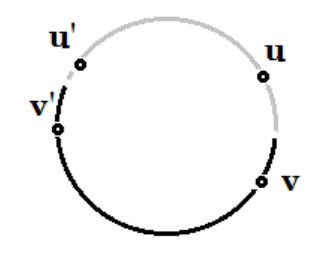

이 사이클 안에서 $u'$은 $T^{(k)}$ 안에 있고, $v'$ 은 $T^{(k)}$ 밖에 있는 $e$와 다른 어떤 한 edge $e'=(u',v')$ 을 고르자

(회색선은  $T^{(k)}$ 의미)

 그때 prim 알고리즘에서는 weight가 작은 edge를 선택하므로 $e$를 선택 했다면 $ w(e) \le w(e')$ 인 상황이다. 

$T ' = T^* - e' + e$ 라고하면, 

$|T'| \le |T^*|$ 가 되므로 $T^* $는 optimal 이 아닌 모순적 상황이다.

따라서, 매 iteration 마다 prim 알고리즘에 의해 추가되는 $e$는 MST $T^*$ 에 포함된 edge이다.

[한글 blog 증명](https://m.blog.naver.com/PostView.nhn?blogId=babobigi&logNo=220492017389&proxyReferer=https%3A%2F%2Fwww.google.com%2F)


[^2]: 최상의 정점(중심)을 루트(Root Node)로 하고, 모든 그룹 멤버들을 자손으로 갖는 트리구조

[^3]: 어떤 그래프가 [connected](https://en.wikipedia.org/wiki/Connectivity_(graph_theory)) 되었다는건 모든 정점들 간에 path가 반드시 존재하는 그래프


### Flow Maximization

**flow network (2018_2 APM hw3 참조)**

**(1) flow network definition:** 그래프에는 src, sink node가 있고, edge가 있으면 nonnegative capacity 를 갖고, edge가 없으면 capacity가 0 이됨. 

**flow definition:** capacity $c$ , src, sink 노드 $s, t$ 를가진 flow network $G = (V,E)$ 에 대해서 edge $E$ 를 어떤 실수값 $ \R $  로 mapping 시켜주는 함수 인데, 2가지 성질을 갖는다. 

1. Capacity constraint: $ 0 \le f(u,v) \le c(u,v) $  ,$\forall (u,v) \in E $

   > flow 값이 제한됨

2. Flow conservation: $\sum_{(u,v)\in E}{f(u,v)}  = \sum_{(v,w)\in E}{f(v,w)} $ ,$\forall v \in V - \{s,t\} $

   > src, sink 를 제외한 노드 $v$에 들어온 flow 양과  나가는 flow 양이 같다. 

**(2) flow maximization problem definition: **Given a flow network G with source s and sink t , find a flow of maximum value from s to t

**LP formula: **$Maximize$ $\sum_{v\in V}{f(s,v)}$   $s.t$  Capacity Constarint, Flow conservation 

이때, capacity 는 주어진 graph의 weights $c(u, v) = w(u,v)$

> 이 문제는 residual network와 augmenting path 라는 개념을 통해 
>
> Ford Fulkerson algorithm에 의해 풀릴 수 있다.

#### Ford Fulkerson

이 알고리즘을 설명하기전에 먼저,  residual network $G_f$ 와 augmenting path의 개념을 알아야한다.

Definition of $G_f$: 주어진 flow network $G$ 와 동일한 정점과 간선을 갖는다. 그리고,  

residual capacity 정의는 다음과 같다.  

(주의사항: edge가 $(u,v),(v,u)$ 둘다 있을때는 $c_f(u,v)  = c(u,v) - f(u,v) + f(v,u)$ ) 
$$
c_f(u,v) = \left \{ \begin{matrix}
c(u,v) - f(u,v)  & \text{if } (u,v) \in E \\ 
f(v,u) & \text{if } (v,u) \in E \\
0 & \text{o.w } \\
\end{matrix} \right.
$$

> augmenting path는 src $s$ 에서 sink $t$ 까지 모든 residual capacity가 0 이상인 simple path를 말한다.  
>
> $G_f$ 는 augmentation 연산이 superposition으로 계산될 수 있는 특성을 가진다. ($G_f$는 flow $f$에 의해 생성된 residual network 이고, $f'$ 은 $G_f$의 또 다른 flow. 따라서, flow는 포화 될때 까지 계속 augmented될 수있다.) 
>
> |$f \uparrow f $| $=  |f| + |f'|$ 
>
> augmentation 연산을 다음과 같다.
> $$
> f \uparrow f' (u,v) = \left \{ \begin{matrix}
> f(u,v) + f'(u,v) - f'(v,u) & \text{if } (u,v) \in E \\
> 0 &\text{o.w} \\
> \end{matrix}\right.
> $$

먼저, Ford-Fulkerson 방식에 대한 pseudo code 

Time complexity: $O(|E|f^*)$ , $f^*$ 은 flow를 업데이트 한 총 횟수 (운이 나쁘면 매우 오래걸릴 수 있다.)

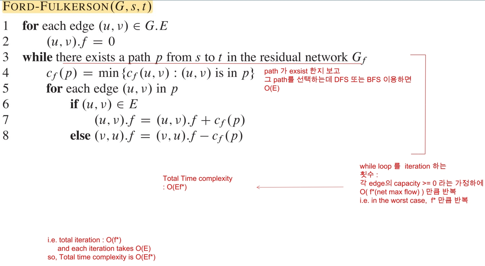


#### [Edmonds-Karp algorithm](https://cp-algorithms.com/graph/edmonds_karp.html) 

(Ford-Fulkerson 방법의 한가지 구현 방법) 

이제, 본론으로 돌아와서 [Edmonds-Karp algorithm]([https://en.wikipedia.org/wiki/Edmonds%E2%80%93Karp_algorithm](https://en.wikipedia.org/wiki/Edmonds–Karp_algorithm))의 기본 idea는 다음과 같다. 

$G_f$ 에서 $s \rightarrow t$ 로 가는 path를 찾을 때, 모든 edge들의 weight를 1로 한(unit distance로 본) [BFS 알고리즘](https://gmlwjd9405.github.io/2018/08/15/algorithm-bfs.html) 을 이용함. [DFS, BFS c++](https://github.com/SUNGWOOKYOO/Algorithm/blob/master/src_Cplus/graphAlgo/DFS_BFS.cpp)

> 이때 주목해야 할 intuition은 각 iteration 마다 찾아진 augmenting path 중에 적어도 한개의 edge는 saturated($c_f(e) = 0$) 되며 (왜냐하면 flow가 update 될때, $G_f$ 의 residual capacity값이 바뀌게 되는데 그에 따라 BFS 하는 방향 이 계속 바뀜 ), 점점  augmenting path의 길이는 길어진다. 이때, 증가되는 augmenting path의 최대 길이는 |$V$|$-1$이기 때문에 모든 iteration에서 flow가 증가한 수$ f^* $는 $O(|V||E|)$ 로 bounded 된다. 

**pseudo code [ref](https://brilliant.org/wiki/edmonds-karp-algorithm/#algorithm-pseudo-code)**

Edmonds($G, s, t$)

​		$G_f \leftarrow G$ 

​		for each edge $(u,v)$ in $G.E$

​				$(u,v).f$ = 0

​		# iteration

​		while $\exist ~ p$ from $s$ to $t$ using $BFS(G_f)$

​				$c_f(p) = min \{ c_f(u, v): (u,v) ~ in ~ p\}$

​				# aumentations

​				for each edge $(u,v)$ in $p$

​						if $(u,v) \in G.E$

​								$(u.v).f  = (u,v).f + c_f(p)$

​						else 

​								$(u.v).f  = (u,v).f - c_f(p)$


time complexity: $O(|V||E|^2 )$ 왜냐하면, BFS 하는데 $O( |E|)$,  총 flow augmented 수 $O(|V||E|)$


### Maximum Bipartite Matching

bipartite그래프에서 최대한 많은 수의 matching[^1]을 찾는 문제 

이 문제는 Flow Maximization를 푸는 것을 이용할 수있다.  

max matching size = total net flow 를 이용한다.

```markdown
1 Given bipartite graph G
2 Add new vertices s and t.
3 Add an edge from s to every vertex in L.
4 Add an edge from every vertex in R to t.
5 Make all the capacities 1.
6 Solve maximum network flow problem on this new graph G'
```

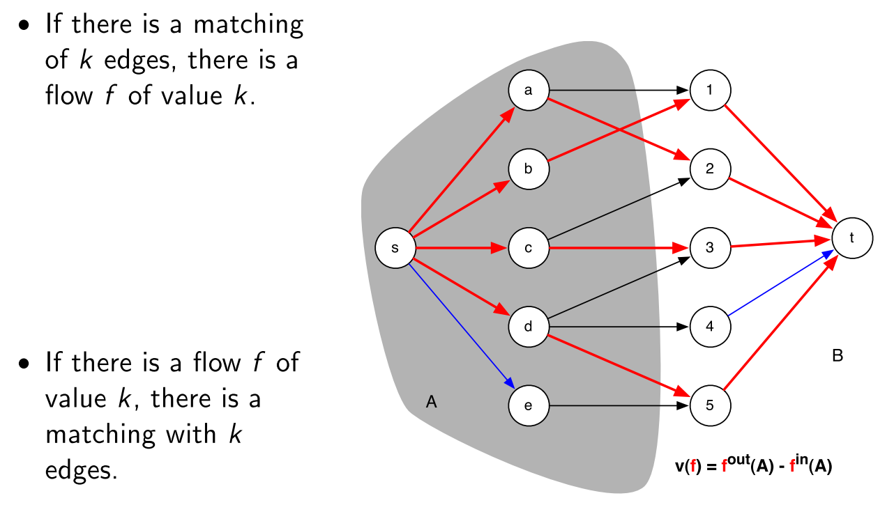

[pdf 영문 slide 설명](https://www.cs.cmu.edu/~ckingsf/bioinfo-lectures/matching.pdf)

[^1]: A matching in a graph is a subset of its edges, no two of which share an endpoint.


### Min Cut 

ST-Min Cut 문제는 directed edge weighted graph $G$의 vertex set $V$를 2개의 set $S, T$로 나누는데 $S$는 $s$를 포함한 집합, $T$는 $t$를 포함한 집합이다.  이때, $S$와 $T$를 *crossing*하는 edge weight를 최소화 하고 싶은게 이 문제이다.

> Given an directed (edge weighted) graph $G=(V,E)$, with a source vertex $s$ and a sink vertex $t$, compute a st-cut ($S,T$) so that the sum of the crossing edge weights is the minimum.

이 문제는 Flow Maximization를 푸는 것을 이용할 수있다. 

**max-flow min-cut theorem** (three conditions are equivalent)

1. $f$ is a maximum flow in $G$. (flow maximization problem solution)

2. The residual network $G_f$ contains no augmenting paths. (terminate condition of flow maximization)

3. $|f| = c(S, T)$ for some st-cut $(S, T)$ of $G$.  (mincut problem solution)

   > $ c(S, T) = \sum_{u \in S} \sum_{v \in T}{c(u,v)}$  ,여기서 $c(u,v)$ 는 residual capacity of $(u,v)$  

Proof. We will prove 3 $\Rightarrow$ 1, 1 $\Rightarrow$ 2, 2 $\Rightarrow$ 3

(3 $\Rightarrow$ 1) From the capacity constraint, any flow f and any st-cut $(S', T')$, we have that $|f| ≤ c(S', T').$ 
$$
\begin{aligned}
\mbox{total net flow } |f| &= \sum_{u\in S'}\sum_{v\in T'}{f(u,v)} - \sum_{v\in S'}\sum_{u\in T'}{f(v,u)} \\
&\le \sum_{u\in S'}\sum_{v\in T'}{f(u,v)} &\because |f| \ge 0 \\
&\le  \sum_{u\in S'}\sum_{v\in T'}{c(u,v)}  &\because f(u,v) \le c(u,v)\\
&= c(S',T')
\end{aligned}
$$


From this inequality,   $|f|=c(S', T')$ implies $f$ is max flow. Thus, we have that 3 $\Rightarrow$ 1.

 (1 $\Rightarrow$ 2) 모순을 이끌어 내기 위한 가정으로 1은 True인데, 2는 False라고 가정해보자. 

즉, $f$ 는 $G$의 max flow인데, $G_f$ 는 augmenting path $f'$를 가진하고 하자.

그러면, $G_f$의 augmenting path $f'$을 더 함으로서 $|f+f'| = |f|+|f'|$ property에 의해 $f$를 증가시킬 수 있다. 

이 상황에서, 우리는 1 이 False($f$는 더이상 max flow가 아님)가 된다. 

따라서, 모순이므로, 1이 True면 2는 반드시 True여야한다.

(2 $\Rightarrow$ 3)  Let $S$ to be the set of vertices in $G$ that is reachable from $s$ by a path with positive edge capacities (of $G_f$), and let $T = V − S$. 

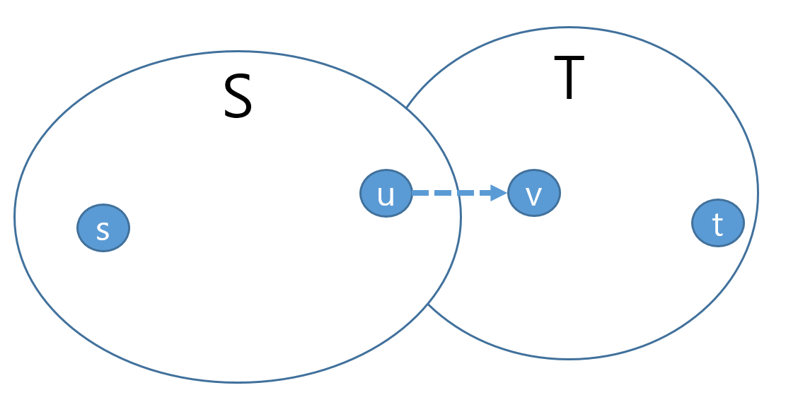

2가 True이면 augmenting path가 더이상 없으므로  <u>T에 속한 v 에 절대 reachable 할수 없다.</u> 그래서, $|f| = c(S,T)$ (3 도 True)라고 할 수 있다.

**만약 2가 True가 아니라면,** augmenting path가 있다는 것이고, 그말은 즉슨,  residual capacity 보다 작은 flow f(u,v) 가 존재한다는 뜻( $\exist f(u,v) < c(u,v)$)이여서 $u$에서 $v$로 갈수 있는 augmenting path가 존재하게 되어 <u>T에 속한 v 에 reachable 할수있게 된다.</u>  즉,**2가 False 가 되는 모순**이 되므로 반드시 2가 True인 상태에서 3 이 True 가 된다.


### Max Cut

Efficient algorithm: Goemans and Williamson (Approximate algorithm)

Approximate algorithm에서 다루도록 하겠다.


## Reference 

[1]: https://opendsa-server.cs.vt.edu/ODSA/Books/Everything/html/index.html	"reference blog "

