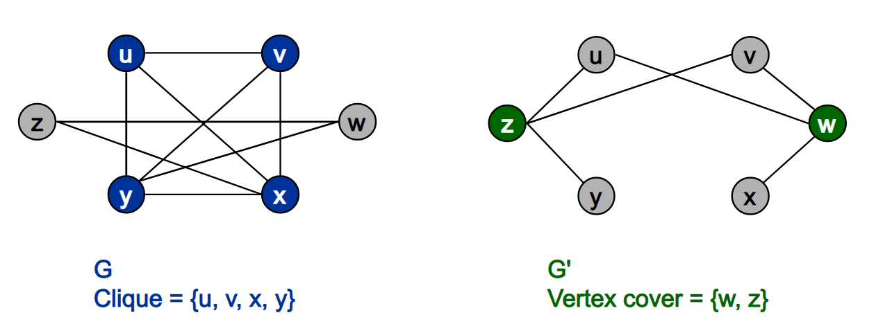
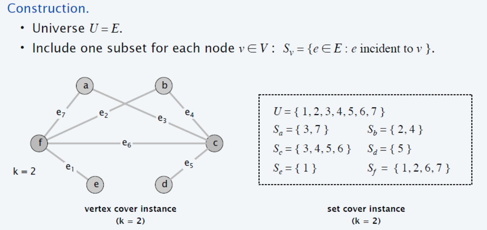
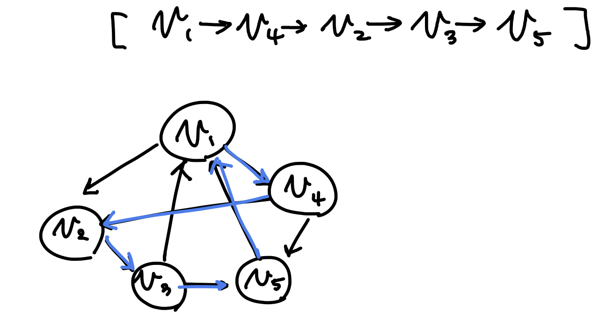
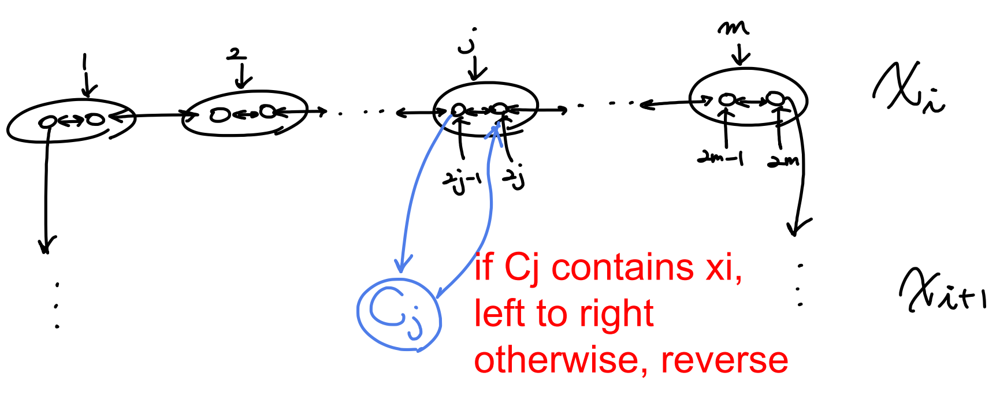
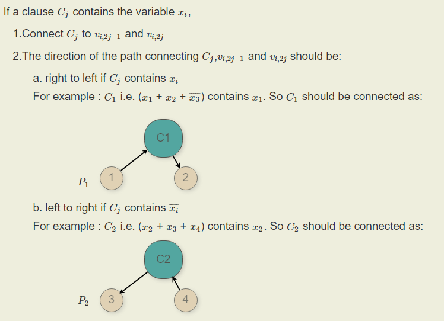
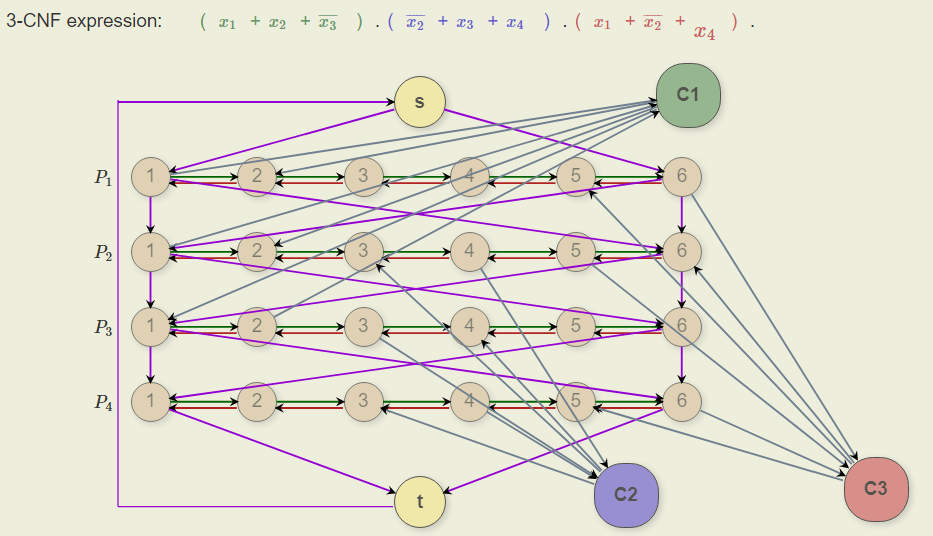
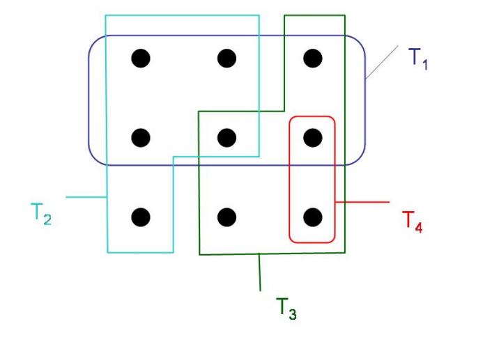

# AMP-2

## Contents

[NP Complete](#NP-Complete)

[Approximation](#Approximation)

[Approximation Technique](#Approx-Technique)

[DM, ML Algorithm](#DM,-ML-Algorithm)

## NP Complete

### Definition

*Definition of P*

 질문자체에 대해서 예 혹은 아니오로 다항식 시간안에 답할 수 있는 문제

> The class of problems that can be decided in polynomial time

*Definition of NP* 

 예라는 근거가 주어졌을 때 그것이 Yes임을 다항식 시간안에 확인 할 수 있는 문제 

> 1. Set of decision problems so that for any yes instance, it has a verifiable proof so that with the proof, one can be verify that the instance is yes in a polynomial time by a Turing machine.
> 2. Set of decision problems that can be solved by a Non-deterministic TM (NTM) in a polynomial time of the input bit size.

*Definition of NP-hard*

 Np-hard는 이 집합에 속한 문제들 대해서 서로 다항식 시간 변환[^1]이 가능한 문제 집합이다.

> If we could solve this problem in polynomial time, we could solve all NP problems in polynomial time

*Definition of NP-Complete*

 Np 이고 Np hard 를 만족하는 문제. 따라서, 이중 하나의 문제라도 polynomial time안에 풀린다는 것을 증명하면 Np-hard에 속한 모든 문제가 polynomial time안에 풀린다.

풀어서 말하면, 지금까지의 기술로는 다항시간에 풀기 어렵다고 판단되면서, 서로 밀접한 논리적 연결관계를 가진 문제들의 집합이다. 

왜 중요한가? **어떤 문제의 최적해와 유사한 decision version(Yes or No question)에 대한 문제를 푸는 알고리듬**을구하면 **그 문제와  reduction 할 수 있는 문제도 풀수 있게 되므로**, 최대한 많은 NP complete 연결고리를 찾는 것이 좋다. 

> The set of NP-complete problems are all problems in the complexity class NP for which it is known that if any one is solvable in polynomial time, then they all are. 
>
> conversely, if any one is not solvable in polynomial time, then none are.


[^1]: 다항식 시간 변환은 변환이 다항식 시간안에 이루어지고 두 사례의 답의 존재성(Yes or No)이 일치하는 문제이다


### SAT

 **Problem:** 논리곱 정규형(CNF(Nonjunctive Normal Form))의 부울 식이 주어졌을 때 그 식을 만족하는 변수를 찾는 문제

> *Cook-Levin Therom* 
>
> SAT 문제는 NP complete이다.  

**3-SAT is NP:**  Since for any yes instance (satisfiable CNF formula), there is a proof (satisfying assignment) so that with this proof a polynomial time algorithm (that checks whether the given assignment makes the CNF formula to be true) can confirm that the instance is a yes case.


### Clique

**Problem:** undirected 그래프 $G = (V,E)$ 에서 size $k$짜리 Clique[^2] 가 존재하는가

**Clique is NP: ** clique인 subgraph에서 모든 pair의 vertices가 연결이 되어있는가 $O(N^2)$ 안에 확인 가능 (vertice 수를 $N$ 이라 하면)
**Clique is Np-hard 증명 [그림 및 detail](https://opendsa-server.cs.vt.edu/ODSA/Books/Everything/html/threeSAT_to_clique.html)  **

> 일단, NP-hard 집합의 개념 이해 필요!  NP-hard 어떤 문제를 polynomal 안에 풀수 있다면(진짜 풀 수있는지는 모름), (NP-hard 안의 모든 문제들 사이에서 polynomial time 안에 변환이 가능해서)NP-hard안에 있는 모든 집합의 문제들이 전부 polynomial 안에 풀릴 수 있는 문제들의 모임. 
>
> if 3-SAT $\le_p$ Clique (3-SAT is reducible to Clique), Clique is NP-hard  (3-SAT 는 어려운 문제고, reduction algorithm 에 의해 3-SAT를 Clique로 변환가능한데, 이게 만약 polynomial 안에 풀리면, 3-SAT, Clique 모두 polynomial time안에 풀 수 있는 것임). 따라서, polynomial reduction 알고리즘과 $\Leftrightarrow$ 관계를 설명해야 함

**Reduction  algorithm:** 어떤 한 3-SAT인 boolean equation $\Phi$ 가 주어졌을때, 각각의 literal 에 대해서 vertex를 만들고, 자기가 속한 clause의 literal과 다른 clause에서의 negation을 제외한 나머지 에 대해서 edge를 만든다. ($\Phi$ 안에 총 m 개의 clause가 있다면 m개의 cluster가 생김). 이 과정은 $O(N^p)$ 걸림.

(여기서 알수있는 intuition은 각 생성된 graph의 vertex가 연결되 있다면, 그에 대응하는 literal 쌍은 동시에 True)

**3-SAT $\Rightarrow $  k-Clique:** 3-SAT가 satisfiable하면(각 clause 마다 적어도 하나의 literal이 True, 게다가 negation은 연결하지 않았음), (각기 다른 clause 에서 파생된 vertex는 반드시 연결되어 있기 때문에) clause의 수(m=k) 사이즈의 clique가있을 수 밖에 없다. 

**k-Clique $\Rightarrow$ 3-SAT:** k-Clique가 그래프에 있다면, (k개의 cluster에서 하나씩의 vertex가 연결이 되어 있어서 그에 대응되는 clause의 literal이 모두 True가 되므로)모든 clause는  True가 되어  $\Phi$는 satisfiable하다.


[^2]: 그래프에서 어떤 pair의 vertices 라도 connected 되어 있는 sub graph의 vertex set


### Independent Set

**Problem:**  undirected  graph $G$ 에서 size $k$ 짜리 IS[^3] 가 존재하는가

**IS is NP: ** IS set에서 모든 pair의 vertices가 연결이 되어있는가 $O(V^2)$ 안에 확인 가능

**IS is Np-hard 증명**

**Reduction algorithm**:  graph $G = (V, E)$ 가 주어졌을때, graph의 edge에 대해 complement 연산을 수행하면 

$\bar{G} = (V, \bar{E})$ 가 되는데 이 연산은 모든 vertex pair에 대해 edge가 존재하는지 확인하고 있다면 삭제하고, 없으면 새로 edge를 만드는 작업이므로 $O(V^2)$ 이 걸림

**Clique $\Rightarrow $ IS:** clique set 이 size $k$ 짜리 $A$ 라고 하고, graph를 complement를 했을때,  $A$ 의 원소인 vertex들 사이의 edge가 존재하지 않으므로 $A$ 는 size $k$ 짜리 IS가 됨 

**IS $\Rightarrow $ Clique:**  IS set 이 size $k$ 짜리 $A$ 라고 하고, graph를 complement를 했을때,  $A$ 의 원소인 vertex들 사이의 edge가 항상 존재하므로 $A$ 는 size $k$ 짜리 clique가 됨 


[^3]: IS(Indpendent Set)의 정의는 graph $G$ 가 주어졌을때, 서로간의 edge가 전혀 없는 vertex set (Clique의 반대)


### Vertex Cover

**Problem:** undirected graph $G$ 에서 size $k$ 인 Vertex Cover[^4]가 존재하는가에 대한 문제

**Vertex Cover is NP: ** size $k$ 의 VC $V'$가 주어지면, graph $G$ 의 모든 edge $(u,v)$ 마다  $V'$안에 $u,v $ 둘중 하나가 포함되어있나 확인, 따라서, polynomial time 이 걸린다. naive한 알고리즘의 예로, $O(EV') = O(EV)$ 

```python
#given G.E, V' in VC set,
for (u,v) in G,E 
	for k in V' 
		if k == u or k == v 
			pass
        else 
        	return False
return True 
```

**Vertex Cover is Np-hard 증명**

**Reduction algorithm**:  graph $G = (V, E)$ 가 주어졌을때, graph의 edge에 대해 complement 연산을 수행하면 

$\bar{G} = (V, \bar{E})$ 가 되는데 이 연산은 모든 vertex pair에 대해 edge가 존재하는지 확인하고 있다면 삭제하고, 없으면 새로 edge를 만드는 작업이므로 $O(V^2)$ 이 걸림



**Clique $\Rightarrow $ VC:**  주목할점: $k-clique \Rightarrow |V|-k$ size 의 $VC$ 

만약 주어진 graph $G$ 에  $k-clique$ set $A \sub V$와 graph의 complement 연산을 한 $\bar{G}$ 가 있다고 하자. 

만약 $(u,v) \in \bar{E}$ 이면, $u,v$ 둘중 하나는 반드시 $V-A = V'$  에 속한다. 

(왜냐하면 $(u,v) \notin E $이면 $u,v$ 둘중 하나는 반드시 $V-A$에 속하기 때문이다.)

따라서, $V'$ set 이 Vertex Cover set이 되고, size는 $|V|-k$ 짜리 가 된다. 

**VC $\Rightarrow $ Clique:**  주목할점: $|V|-k$ size 의 $VC$ $\Rightarrow k-clique$  

만약 $u,v \notin V'$ 이면, complement를 하면 $(u,v)\in E$ 가 반드시 존재하므로 $V-V'= A$는 Clique set 이다. 


[^4]: undirected 그래프에서 모든 간선의 양 끝점을 포함하는 정점들의 집합들 중 최소의 집합(optimal vertex cover)을 찾는 것. 즉, 어떤 edge를 선택하더라도, edge pair중 적어도 하나의 vertex가 포함되도록 하는 집합


### Set Cover

**Problem:** 말 보다 수식으로 표현하는게 더 쉽다.  
$$
U \supset C \supset C'\text{with size k } \\
\text{FIND } C'\text{s.t } \underset{S_i \in C'}{\cup}S_i = U
$$
**SC is NP:** naive 하게 생각해보면 주어진 $C'$를 가지고 $\underset{S_i \in C'}{\cup}S_i = U$ 이 되는지 확인하면 된다. $U$에 있는 모든 원소수가 $n$ 개라고 가정하고, 집합 $C'$의 원소 집합 $S_*$수를 m개 라고하면 $O(nm)$이므로 polynomial time이 걸림

**SC is NP-hard**

**Reduction algorithm:** 

size $k$ 짜리 Vertex Cover instance가 undirected  graph $G =(V, E)$에 있을때, 이를 어떻게 Set Cover 문제로 바꾸고, 어떤 instance를 만드는지에 대해 설명하겠다. 

Set Cover에서 커버할 모든 원소는 graph $G$의 모든 edge $E$로 한다. 따라서, 커버할 set $U = E$가 됨.

또, $C'$ 의 각 원소집합 $ S_i $는 graph $G$에서 $v_i$ 에 incident한 edge들로 구성된다.    

($G$에서 전체 edge $G.E = U$로 만들고, 각각의 vertex마다 incident한 edge를 check하여 set $F=\{S_v\}|_{v \in G.V}$를 만드는것은 모든 vertex 마다 incident edge를 체크해야하는데, edge하나당 vertex 는 2개 연결되어있으므로 naive 하게 생각하면 $O(2|E|)$ 시간 필요. 따라서,  polynomial time이 걸림 )

이렇게 변환된 Set Cover 문제의 size $k$는 Vertex Cover size $k$ 와 동일하다. (왜 그런지는 증명을 보면 됨)



**VC$\Rightarrow $ SC:** VC set의 정의는 모든 edge 에서 한쪽 정점은 반드시 VC set에 걸쳐 있다. 따라서 Vertex Set에 속한 k 개의 정점들 $v_i|_{i=1,..,,k}$에 대해 대응된 k개의  $S_i|_{i=1,..,k} = C'$ 들만 골라서 union하면 모든 edge 원소들 A를 커버하게 된다. 

**SC $\Rightarrow $ VC:** Set Cover의 instance에서 A를 cover하는 k개의 $S_i|_{i=1,..,k} = C'$에 대응된 vertex들 $v_i|_{i=1,..,,k}$ 집합이 VC set 을 이룬다. 왜냐하면 $S_i|_{i=1,..,k} = C'$ 가 A를 커버한다는것은 모든 edge E를 커버한다는 것이고, $S_i$ 는 $v_i$에 incident 한 vertex set으로 이루어졌으므로,  $v_i|_{i=1,..,,k}$ 역시 모든 edge를 커버하기 때문에, edge에서 정점 2개중 하나는 반드시 $v_i|_{i=1,..,,k}$에 포함된다.


### Set Sum


### Hamiltonian Path

**Problem:** <u>directed graph</u>.에서 모든 vertices 를 한번씩만 방문하는 path(Hamiltonian path)가 있는가 (cycle도 비슷하다.)

**[HAMPATH is NP](https://www.geeksforgeeks.org/proof-hamiltonian-path-np-complete/): **어떤 graph에서 HAMPATH 가 주어지면, 그것은 서로 다른 vertex sequence인데, 각각의 연속된 정점 간의 edge 가 graph에 있는지 확인하는데 polynomial time이 걸린다.

> Check if every vertex (except the first) appears exactly once, and that consecutive vertices are connected by a directed edge

 

**Ham-Path is NP-hard**

**Reduction algorithm:**  3-SAT의 literal $x_1, .., x_n$에 대해서m 개의 clause가 있었다면,  각 literal마다 $2m$ 개의 정점들로 구성된 양 방향 horizontal path를 만들고,  literal 순서대로 양끝을 이어 나간다. 



그 후에, 각 clause 마다 정점을 하나씩 만들고, 3-SAT에서 $x_i$ 가 True였다면 왼쪽에서 오른쪽으로, 아니였다면 반대로 path를 만든다. 



따라서, 다음과 같이 완성



**Ham-Path $\Rightarrow $ 3-SAT:** 만약, hamiltonian cycle에서 $x_i$ 에대한 horizontal path가 왼쪽으로 오른쪽이었다면, $x_i$ 를 True로, 아니면 False로 assign한다면 Boolean 수식은 satisfiable하게 된다. 왜냐하면 hamiltonian cycle에서 각 clause에 대한 node를 한번씩 지나게 되는데 그 한번만 지날때의 horizontal path에서 literal이 clause를 True로 만들게 된다. 따라서, 모든 clause가 True가 되어 satisfiable하다. 

**3-SAT$\Rightarrow $ Ham-Path:** 
각 horizontal path에 대응하는 literal이 True였다면 왼쪽에서 오른쪽으로 path를 결정하고, 그게 아니면 오른쪽에서 왼쪽으로 결정한다면 결국에는 hamiltonian cycle이 된다. 

[영문 설명1](https://opendsa-server.cs.vt.edu/ODSA/Books/Everything/html/threeSAT_to_hamiltonianCycle.html)  [설명2](https://www.geeksforgeeks.org/proof-hamiltonian-path-np-complete/)


### TSP
**Problem:** <u>undirected complete graph</u> $G$에서 가중치의 합이 $k$ 인 TSP[^5] 가 존재하는가의 유무

**TSP is NP:**  $V$ 개의 정점 sequence(cycle에서 마지막 정점 제외)가 주어지면, 각 정점이 1번 등장하는지 우선 체크하고, edge weight의 합이 $k$ 가 되는지도 체크 한다.(Hamiltonian Path 때와 비슷하게 consecutive하게 체크)

**TSP is NP-hard**

**Reduction algorithm:** Hamiltonian Cycle 을 가진 directed graph $G = (V,E)$를  

TSP instance 를 가진 undirected complete weight graph $G' = (V,E')$ 로 바꿔야한다.

따라서, 모든 노드들간의 edge를 만들어주되, 원래 edge가 없는데 새로 만든것은 weight를 $1$ 아니면 $0$을 부여 

그렇게 만들면, TSP instance의 $k$ 값을 $0$으로 하는 instance가 있는 graph $G'$을 만들 수 있다.
>  Q : (무향 완전 가중 그래프를 주며) 이 그래프에서 모든 노드들을 한번씩만 방문하고, 그 가중치의 합이 0인게 있어? (Decision version) 
$$
E' = \{ (i,j): i,j \in V \and i \neq j \} \\
c(i,j) = 
\begin{cases}
0 &\text{if }(i,j) \in E \\
1 &\text{if }(i,j) \notin E
\end{cases}
$$

**Ham-Cycle $\Rightarrow $ TSP:**  Ham-Cycle이 있는 그래프 G에서 변형된그래프 G'에도 $k=0$인 TSP가 존재하기위한 intuition은 G에 없었는데 추가된 edge를 TSP에서 절대 지나면 안된다. 즉, 원래의 Hamiltonian cycle instance자체가 $k$가 $0$인 TSP가 된다. 

**TSP $\Rightarrow $ Ham-Cycle:** $k=0$ 인 TSP 는 $E$ 상의 edge만 지나는 cycle이다. 따라서, 그 TSP가 곧 hamiltonian cycle instance가 된다.


[^5]: Traveling salesman Problem 으로 complete graph 에서 edge를 weight sum를 최소로하는 hamiltonian cycle을 찾는 것이 optimization problem이고, decision version problem은 edge의 가중치의 합이 k hamiltonian cycle이 존재하는가의 문제

[한글 blog 설명](https://zeddios.tistory.com/176)


## Approximation 

NP complete 을 다루는 위해  문제 범위를 좁히기 위해 problem종류는

Optimization version, Decision version, Gap version problem이 있다.

또한, Algorithm은 Exact Algorithm 과 Approximation Algorithm 범주로 나뉜다.

Approximation 알고리즘에 사용되는 여러 technique들이 있다.

*Approximate Ratio:* $\rho \ge max(\frac{C^*}{C}, \frac{C}{C^*}) \ge 1$

approximation algorithm이 exact algorithm에 비해 최대 얼마정도의 비율로 garantee 하는가를 알 수 있다.

일반적으로 $\rho$-* algorithm 으로 사용 

#### PTAS, FPTAS

*PTAS*: Ploynomial-time approximation scheme. Input size $n$ 에 ploynomial 하다.

하지만,  어떤 요소 $\epsilon$ 에따라 exponential 해지는 요소가 있다.

*FPTAS*: Fully polynomial-time approximation scheme. Input size $n$ 에 ploynomial 하다.

하지만,  어떤 요소 $\epsilon$ 에따라 반비례하여 증가하는 요소가 있다.

#### Vertex Cover

임의의 edge (u,v)를 선택하여 VC set에 추가하고, graph 에서 $(u,v)$ 와 incident 한 edge들을 제거한다.

```python
VC(G)
	# Vertex Cover 
	create set C
    # helper set for Vertex Cover 
    create set E`
    E` ← G.E
    
    while E != {}
    	(u,v) ← pick one edge(E`)
    	C = C union {u,v} # vertex 2개씩 추가된다.
        remove from E` every edges incident on either u or v 
    return C 
```

adjacent list 를 사용했을때 모든 graph의 node와 edge를 봐야하므로 $O(V+E)$ 

[python](https://github.com/SUNGWOOKYOO/Algorithm/blob/master/src_Python/sw_NPandApprox/VertexCover.ipynb)

**2-approx algorithm proof** 

**set $A$**를 매iteration에서 $C$로 들어갈 vertex $u,v$로 이루어진 **edge $(u,v)$들의 set** 이라고하면

set $A$의 size는 $C$ size의 절반이다. (매 vertex가 2개씩 추가되는데 $A$는 edge set 이고, **$C$는 vertex set** 이니까)
$$
|C| = 2|A|
$$

이때, $A$의 어떤 엣지라도 endpoint를 공유하지 않는다는 사실을 주목하자. 그러면 $A$의 어떤 2개의 edge 를 골라도 optimal vertex set $C^*$ 에 있는 vertex 원소 하나에 의해 cover 되지는 않는다. (즉, A의 어떤 edge든지 적어도 그중 하나의 vertex는 $C^*$ 의 원소에 있어야한다.)
$$
|C^*| \ge |A|
$$

따라서, 
$$
|C^*| \ge |A| \ge |C|/2 \\
\Leftrightarrow \rho=2 \ge |C|/|C^*|
$$


#### Set Cover

PTAS approximation algorithm 의 범주에 속한다. 

greedy choice를 통해 approximated solution을 구한다.

$U$의 원소들중 greedy choice는 커버되지 않고, 남은 원소들에 대해서 $F$ 의 원소 집합중 가장 많은 cover를 할수 있는 set 을 선택 하여 $C'$를 만들어 나간다. 

*notation*
$$
\begin{aligned}
U &= \{ e_1, e_2, ... e_m\} \\
F &= \{ S_1, S_2, ... S_n\} \\
S_i &= \{ \mbox{some elements}\} ~\forall i
\end{aligned}
$$

```python
SC(U, F)
	# uncovered residual elements 
	R = U.copy() 
    # approximated set cover 
    C` = {}
    while R != {}
    	# greedy choice: select an S in F that maximizes |S union R|
        # 남은 element들을 최대로 cover할수있는 S 선택
        S = F[argmax([len(Si ∩ R) for Si in F])]
        R ← R - S 
        C` ← C` union {S}
    return C`
```

while 문이 반복되는 경우의 수는 $min(|U|, |F|)$

왜냐하면  $|U|$가 되는 경우는 cover 되는 원소가 매 iteration 마다 1개씩만 되는 최악의 경우고, 

일반적으로 모든 element가 Set $\{S_{i} \} |_{i=1,..,|F|}$ 에 의해 cover가 되는 경우의 시간이 걸린다.

greedy choice를 하는데 걸리는 시간은 $O(|U||F|)$이므로  

$\because$ $F$의 원소 $S_i$ 마다 $X$와union 해봐야하는데 $S_i$에 있는 원소의 최대수는 $|U|$

총 걸리는 시간은 $O(|U||F|min(|U|,|F|))$

[python](https://github.com/SUNGWOOKYOO/Algorithm/blob/master/src_Python/sw_NPandApprox/SetCover.ipynb)

**(ln|U|+1) - approx algorithm proof** 

이 알고리즘이 끝났을때, 각 원소 $ x \in U $에 대한 cost는 다음과 같이 정의된다. 

원소 $x$ 에 대해 $S_1,..., S_{i-1}$들이 Set Cover의 원소들로 선택된 이후, $S_i$ 에의해 처음 선택이 되었을 때의 cost $c_x$
$$
c_x = 1/|S_i - (\underset{k=1,...,i-1}{\cup}{S_k})|
$$

> Notice that $|S_i − ( S_1 ∪ S_2 ∪ ... ∪ S_{i−1})|$ is the number of elements covered for the first time by
> $S_i$ at $i$ th iteration
>
> Let $c_x$ be the price allocated to element $x ∈ X$, that is covered
> for the first time at $ i $ th iteration.



전체 iteration 동안 cost $|C| = \sum_{x\in U}{c_x}$ 가 된다. 

optimal case일 떄의 cost 를 $\sum_{S \in C^*} \sum_{x\in S}{c_x}$  가 되고  $S_i$ 에도 포함되고, $S_j$ 에도 포함되는 element가 존재 할수 있으므로  (1)이 된다. 
그런데 이때, $\sum_{x\in S}{c_x} \le \sum_{i=1,..|S|}{1/i}$ 즉, harmonic summation에 bounded 되어있으므로 ([증명](https://www.cs.dartmouth.edu/~ac/Teach/CS105-Winter05/Notes/wan-ba-notes.pdf)은 생략)  
$$
\begin{aligned}
|C| &\le \sum_{S \in C^*} \sum_{x\in S}{c_x}  & (1)\\
&\le \sum_{S \in C^*}\sum_{i=1,..|S|}{1/i} \\
&\le |C^*|\sum_{i=1,..|S|}{1/i} &\mbox{for } \underset{S \in F}{max}{(|S|)} \\
&\le |C^*|(ln(|S|) + 1 )\\
&\le |C^*|(ln(|U|)  + 1 )\\
&\Leftrightarrow \rho= (ln(|U|) +1)\ge |C|/|C^*|
\end{aligned}
$$

$U$ 의 size가 커질수록 log scale로 approximation ratio가 좋지 않아지므로 

*PTAS* 범주에 속하는 근사 알고리즘이다.


#### Set Sum


#### TSP

[TSP problem](#TSP) 의 optimization problem에 대해서 special case 에 대해서 polynomial time 2 - approximation algorithm 을 구할 수 있다. 

> *special 조건* : <u>complete graph G의 edge들의 weight가 triangle inequality 를 만족하는 경우</u>.

> *Intutition*:  MST를 이용하여 TSP의 solution을 approximation 한다. 
>
> MST의 모든 edge weight의 sum은 TSP의 path 에서 edge들의 weight sum 에 의해 lower bound 되어있다. 
>
> 그런데, G가 triangle inequality 를 만족한다면, TSP의 cost는 MST 의 weight sum의 2배에 upper bound 된다.  이 성질을 이용하자 

DFS를 이용하여 MST를 traversal 하여  한바퀴 도는 정점 sequence $P$를 찾은뒤에 $P$에서 preorder순으로 Euler tour[^6] list $T$가 곧 TSP의 approximation solution이 된다.

```python
# G is undirected weighted complete graph
# G.E should satisfy trangular inequlity 
TSP(G) 
	M ← MST(G)
    P ← Euler tour traversal of M using DFS(G,s)  
	
    T = []
    for v in P
    	if v is first appearance in P 
        	T ← v
    
    # make a cycle
    T ← s 
    return T 
```

알고리즘은 2개의 subroutine으로 구성된다. 먼저 MST를 만드는 작업은 $O(ElogV)$로 polynomial 하고, DFS를 통한 Euler tour를 찾고, preorder를 찾아내어 $T$를 얻는 작업 역시 polynomial 하다.  

[naive code](https://www.geeksforgeeks.org/travelling-salesman-problem-set-1/)

**2 - approximation proof**
$$
\begin{aligned}
|M| 
&\le |OPT| \\
|P| &= 2|M| \le 2|OPT|  &\because \mbox{visit each edge twice}\\
|T| &\le |P| &\because \mbox{triangle inequality} \\
\therefore |T| &\le 2|OPT| \\
\Leftrightarrow \rho &= 2 \ge |T|/|OPT| 
\end{aligned}
$$


[^6]: **Eulerian trail** (or **Eulerian path**) is a [trail](https://www.wikiwand.com/en/Trail_(graph_theory)) in a finite graph that visits every [edge](https://www.wikiwand.com/en/Edge_(graph_theory)) exactly once


#### Baker's Algo for MIS

Approximation Algorithm for MIS(Maximum Independent Set) on Planar Graphs


## Appox Technique

approximation algorithm을 design 하는데 유용한 2가지 technique 

### Randomization

#### Karger's Algo for ST-Min Cut

non-negative undirected edge weight graph 에서 min cut을 random한 방식으로 찾는 알고리즘 

```python
Karger(G) 
	# O(EV^2(logV)^2) 
    for k = 1 to V^2logV
        # one iteration takes O(ElogV)
        while != two vertex remain
            pick random edge (x,y) in G.E with probability ∝ its edge weight
            # merge process 
            while(!∃shared vertex v such that x and y are connected to a vertex v)  
                sum weight of (x,v) and (y,v)
            merge x and y 
```

polynomial time이 걸리지만, 엄청 느린 알고리즘으로 min cut을 구했을때 제대로 구할 확률은 $1-o(1)$ 이다!

**proof**

$|C|$ 를 ST min cut에서의 crossing edge weight의 합이라고하자.

그리고 어떤 한 vertex $u$ 와 연결된 edge들의 합($|C| $)이 

$u$에 연결된 모든 light edge들의 합(optimal mincut $|C^*|$)보다 같거나 크다 점을 주목하자. 

즉,  $|C^*| \le |C| = \sum_{e \in E, ~ u \in e}{|e|} $ 이다. 

확장해서, u를 모든 vertex에 대해서 생각하면 $|V||C^*|$ 는 모든 edge의 합의 2배 $2|E|$에 upper bound된다. 
$$
|V||C^*| \le 2(\frac{1}{2}\sum_{u\in V} \sum_{e\in E, u \in e}{|e|}) =2|E| \\
|C^*|/|E| \le 2/|V|
$$
그런데, $|C^*|/|E|$ 가 의미하는 바는 어떤 edge가 mincut $C^*$에 포함될 확률을 의미한다. 

따라서, $\mathbb{P}(e_1 \notin C^*) \ge 1 - 2/|V|$  이 되고, 

> merge가 반복되며 마지막 2개 남은 vertex edge들의 weight가 crossing edge의 합임을 주목
>
> 위의 식을 이용하여  edge를 선택하여 2개의 vertex만 남을때까지 merge를 반복하는 동안 mincut에 포함될 edge들을 한번도 선택하지 않아 제대로된 mincut을 찾을 확률의 bound를 찾도록 하겠다. 이 말은 즉슨, $|C^*|$를 찾는데 실패할 확률에 대한 bound를 구하겠다는 뜻. 

($|V| = n$으로 두자)
$$
\begin{aligned}
&\mathbb{P}(e_1 \notin C^*) \ge 1 - 2/n \\
&\mathbb{P}(e_2 \notin C^* |e_1 \notin C^*) \ge 1 - 2/(n-1) \\
&\mathbb{P}(e_{n-2} \notin C^* | \and_{j=1,2,..,n-3} e_{j} \notin C^*) \ge 1 - 2/3 \\
\times&------------------- \\
&\mathbb{P}( \and_{j=1,2,..,n-2} e_{j} \notin C^*) \ge \Pi_{j=1,..,n-2}(1-2/(n-j+1)) 
\ge 2/(n(n-1)) \ge 2/n^2 \\

\therefore  \mathbb{P}&(\mbox{이 알고리즘이 iteration 한번동안 mincut에 실패할 확률}) 
\le 1 - 2/n^2 \\  
\mathbb{P}&(.. k번 시행) \le (1-2/n^2)^k \\

&\mbox{ when  }k = n^2logn, \\
\mathbb{P}&(.. n^2logn 번 시행) \le (1-2/n^2)^{n^2logn} = (1-2/n^2)^{(n^2/2)2logn} = o(1) 

\end{aligned}
$$

따라서,  mincut이 성공할 확률이 $1$에 가까워지는것을 증명함


[wiki](https://www.wikiwand.com/en/Karger's_algorithm)


### Linear Programming 

#### Goemans Willianson Algo for Max Cut 

MAX CUT problem with SDP relaxation


## DM, ML Algorithm
### PageRank

M 은 column stochastic matrix[^7] 이어야함 

google pagerank 의 sparse matrix formulation version 을 power iteration을 통해 구한다.

*풀고자하는 수식*

($\delta:$ teleport probability[^8])
$$
\begin{aligned}
r &= Ar \\
A &= \delta M + (1-\delta)[1/N]_{N} \\ 

\because r &= \delta Mr + (1-\delta)[1/N]_{N \times N}~ r \\
& = \delta M + (1-\delta)[1/N]_{N} &\because \sum_i r_i = 1
		
\end{aligned}
$$

```python
PageRank(M, delta=0.8, elipslon=1e-8)
    N = M.shape[0]
    R = np.ones((N,1))*(1/N)
    K = np.ones((N,1))*((1- delta)/N)
    iteration = 0
    distance = INF

    while distance > elipslion:
        prevR = R
        R = delta * np.matmul(M,R) + K
        iteration = iteration + 1
        # L1 norm(euclidean distance)
        distance = np.linalg.norm(R-prevR)

    return R 
```


[python](https://github.com/SUNGWOOKYOO/2019_spring/blob/master/DM/HW4.ipynb)


[^7]: 각 열의 합이 1 인 행렬. 가장 큰 eigen value는 항상 1이다. 따라서, 매 iteration마다 normalize할 필요 없다. 

spider trap를 없애고, dead end 효과를 완화시키기 위해 사용됨 


### Power Iteration, PCA, SVD, CUR decomposition

Power iteration 을 통한 PCA(Principal Component Analysis)

$v_t = (M/||Mv_{t-1}||)v_{t-1}$ 을 수렴할때까지 power iteration을 통해 계산하면 

highest eigen value를 가진 eign vector (즉, principal component)를 얻을 수 있다. 

또한 $M = M - \lambda v v^T$ 와 같은 Gram schmidt process를 통해 PC 성분을 제거 후, 

두번째로 높은 eigen value를 가진 eigen vector를 구할 수도 있다.  

[Power iteration python](https://github.com/SUNGWOOKYOO/2019_spring/blob/master/DM/HW9.ipynb)

[PCA, SVD python](https://github.com/SUNGWOOKYOO/2019_spring/blob/master/ML/PCA_SVD.ipynb)