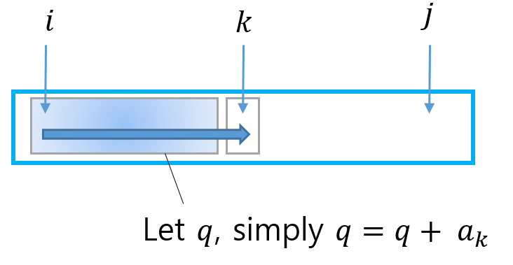
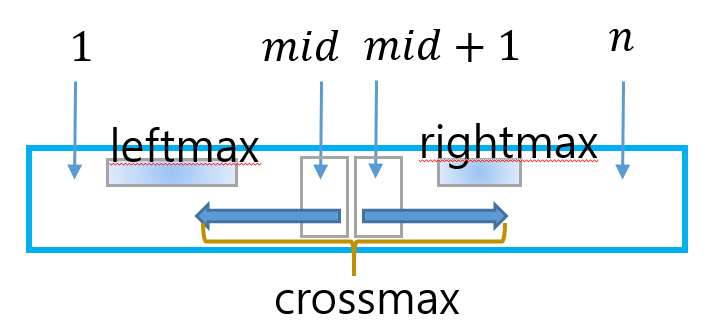
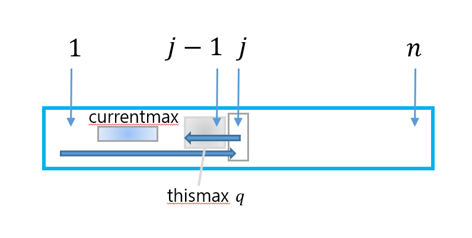
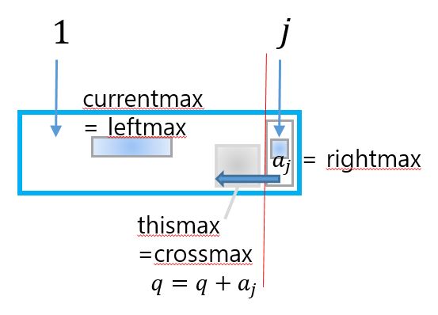

# Algorithm

여러 Algoritm 을 풀어보겠다. 


## Maximum Subarray Problem

array $a[1..n]$이 주어졌을때, 연결된 subarray값의 최대 합을 찾는 문제

**naive** 

find $ \underset{1\le i \le j \le n}{max}(\sum_{k=i}^j{a_k})$

```python
Algo(a)
    n = |a|
    q = 0
	for i = 1 to n 
    	for j = i to n 
        	sum = 0
            for k = i to j 
            	sum = sum + a[k]
            q = max(q, sum)
    return q
```


여기서 개선가능한 부분이 있다.



즉,  $\sum_{k=i}^j{a_k}$를 계산하는데 있어 이전결과를 이용할 수 있다.  

따라서, 다음과 같이 코딩 가능하다.

```
Algo(a)
	n = |a|
	q = 0
	for i = 1 to n 
		sum = 0
		for j = 1 to n 
			sum = sum + a[j]
        q = max(q, sum)
    return q
```


**divide and conquer**

다음 그림과 같은 접근이 가능하다. 



가운데 지점 mid를 기준으로 subproblem 으로 나눠 각각 optimal max subarray를 구한것이 leftmax, rightmax라고 하자. 그리고, 두 subproblem에 걸쳐 존재하는 crossmax를 $a_{mid}$를 반드시 포함하며 왼쪽으로 연결된 subarray 최대합과 $a_{mid+1}$를 반드시 포함하며 오른쪽으로 연결된 subarray의 최대합의 합으로 두고 divide and conquer 방식으로 문제를 푼다.

```python
cross(A, i, mid, j)
	leftmax = -INF, rightmax = -INF 
    for k = mid down to i
    	leftmax = max(leftmax, leftmax + a[k])
    for k = mid +1 to j 
    	rightmax = max(rightmax, rightmax + a[k])
	return leftmax + rightmax

Algo(a, i, j)
	if i == j 
    	return a[i]
    mid = (i + j) / 2
    leftmax = Algo(A, i, mid)
    rightmax = Algo(A, mid + 1, j)
    crossmax = cross(A, i, mid, j)
    
    return max(leftmax, rightmax, crossmax)
```


[c++](https://github.com/SUNGWOOKYOO/Algorithm/blob/master/src_Cplus/MaxSubarray.cpp) [python](https://github.com/SUNGWOOKYOO/Algorithm/blob/master/src_Python/sw_FindMaxArray.ipynb)


**incremental**

incremental 알고리즘은 일반적으로 linear하게 search 해나가며 optimal 값을 찾는 방식이다. 

다음 그림과 같이 $j-1$까지 search했을때의 local optimal한 값을 가지고 있다고 가정하고, $j$ 번째 정보를 활용하여 $j$ 까지의 local optimal 한값으로 업데이트 하는 알고리즘이다.


이 문제의 경우에, divide and conquer의 special한 case로 생각 할수 있는데,  
$j$ 번째에 대한 정보만을 right부분으로 생각하면, 다음 그림과 같이 생각할수 있다.

여기서 알수있는 점은 thismax는 crossmax처럼 생각할 수 있어서 $j$가 증가함에따라 $a_j$에 대한 정보만 update하면 된다. 따라서, crossmax를 $O(1)$만에 구할 수 있으며 간단히 currentmax, thismax 둘중에 더 큰것을 currentmax로 업데이트 하면 된다.

(단,  $a_j$를 포함한 합인 thismax가 0보다 작으면 더이상 thismax를 $a_{j+1}$과의 합으로 하는것은 crossmax가 아니므로 0으로 만든다. )

```python
Algo(a)
	n = |a|
	currentmax = 0, thismax = 0
	for j = 1 to n 
    	thismax = thismax + a[j]
        currentmax = max(currentmax, thismax)
		if thismax < 0
        	thismax = 0
    return currentmax
```


[c++](https://github.com/SUNGWOOKYOO/Algorithm/blob/master/src_Cplus/MaxSubarray2.cpp)

