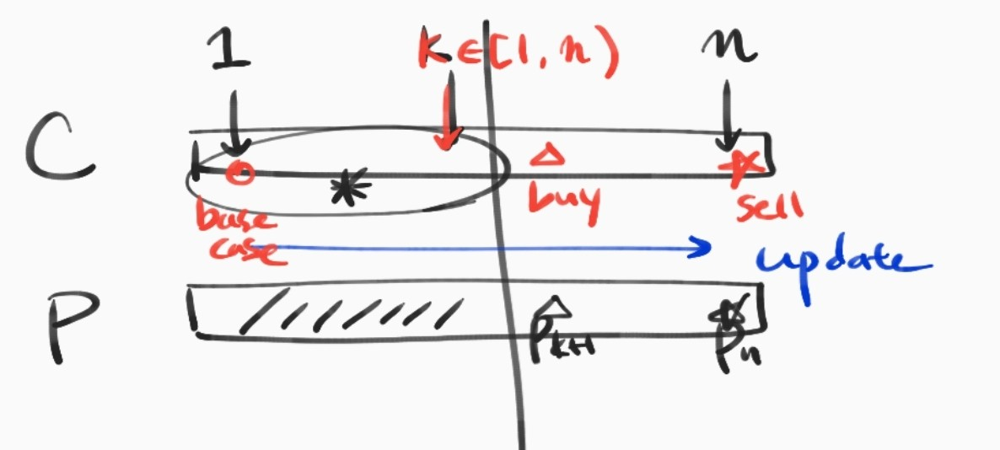

# 714. Stock Problem 

[leetcode](https://leetcode.com/problems/best-time-to-buy-and-sell-stock-with-transaction-fee/)


## Problem Definition

Your are given an array of integers `prices`, for which the `i`-th element is the price of a given stock on day `i`; and a non-negative integer `fee` representing a transaction fee.

You may complete as many transactions as you like, but you need to pay the transaction fee for each transaction. You may not buy more than 1 share of a stock at a time (ie. you must sell the stock share before you buy again.)

Return the maximum profit you can make.


### Naive 

Given size $n$ input, all cases that buy and sell stock prices is $O(2^n*2^n)$.

So, it takes exponetial to find an optimal solution.


### Dynamic Programming

*Notation*
prices array be $p$
optimal profit of size $n$ be $c_n$  

transaction fee $f$

**Description**

Suppose that suproblem $c_k$ are optimal where $1 \le k <n$ .

At first, trivially we can notify $c_1 = 0$ because there are no way to sell the stock(base case).

Inductively, we can find size $n$ optimal solution by updating  $\forall k$.

Look at this picture in order to capture the principal intuitively!



*Reculsive Formula*
$$
c_n = 
\begin{cases}
0 & \text{if }n=1 \\
\underset{1 \le k < n}{\operatorname{max}}(c_k, c_k + p_n -p_{k+1} +f) & \text{if }n \ge 2
\end{cases}
$$

> Warnning: implementation detail 
>
> 

```c++
int maxProfit2(vector<int>& p, int fee) {
    int n = p.size();
    int* profit = new int[n + 1];
    profit[0] = 0;
    profit[1] = 0;
    for (int i = 2; i < n + 1; ++i) {
        profit[i] = std::numeric_limits<int>::min();
        for (int k = 0; k < i; ++k) {
            profit[i] = max(profit[i], 
                            max(profit[k], profit[k] + p[i-1] - p[k] - fee));
        }
    }
    int result = profit[n];
    return result;
}

```

if you want to run this code, visit my [github](https://github.com/SUNGWOOKYOO/Algorithm/blob/master/src_Cplus/714_stock3.cpp)


### Greedy 

Greedy choice exist!

If you see the detail of updating when operating reculsive call, you can notify a rule.

> *Greedy choice* 
>
> When updating $k \in [1, n)$, if transaction margin is good, do it!
>
> So, when updating, as soon as margin is good, the transaction is one of the optimal solution.

```c++
int maxProfit_greedy(vector<int>& p, int fee) {
    int n = p.size();
    if (n < 2) {
    	return 0;
    }
    int ans = 0;
    int minV = p[0];
    for (int i = 1; i < n; i++) {
    	if (p[i] < minV)
    		minV = p[i];
    	else if (p[i] - minV > fee) {
    		ans += p[i] - fee - minV;
    		minV = p[i] - fee;
    	}
    }
    return ans;
}
```


